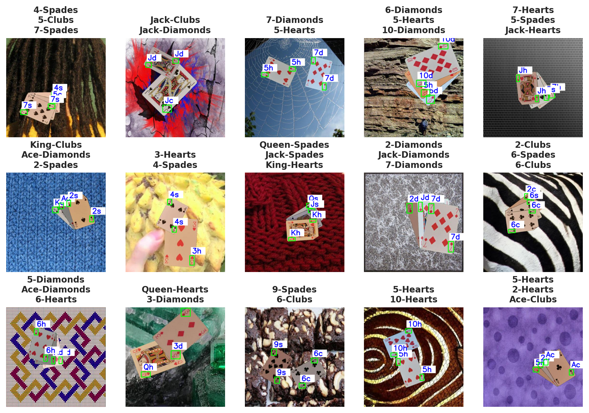
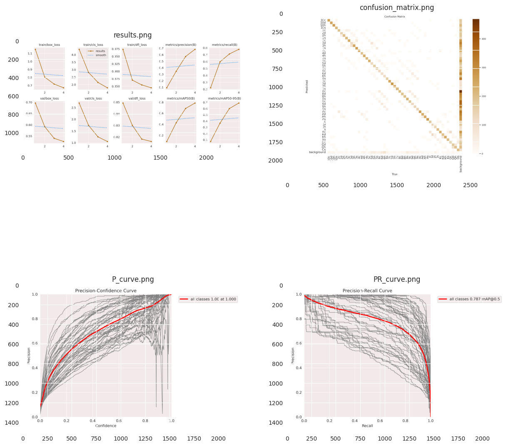
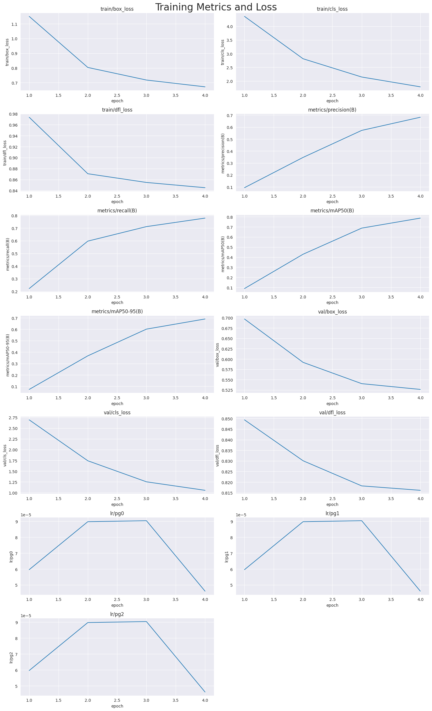
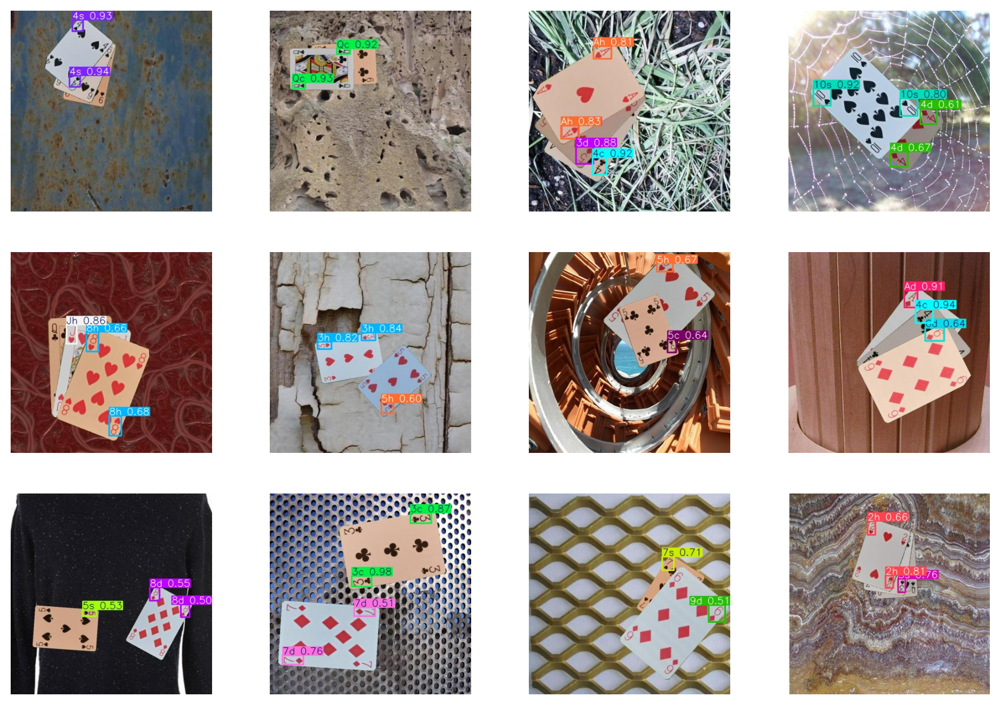

<center>

<a id=1></a>
# <p style="padding:10px; margin:0;font-family:newtimeroman;font-size:120%;text-align:center;border-radius: 30px 10px;overflow:hidden;font-weight:700;background-color:#003285; color:#e3f6f5">playing-cards-object-detection-yolov8

<center>

<a id="0"></a>
<div style="border-radius: 10px; box-shadow: 0 2px 4px 0 rgba(0, 0, 0, 0.1);border:2px solid #90e0ef; padding: 20px">  
    
### **[1. About this Notebook](#1)**
   - [1.1 About Dataset](#11)
   - [1.2 Import Libraries](#12)
   
### **[2. Setups](#2)**
   - [2.1 Install Lobraries](#21)
   - [2.2 Import Libraries](#22)
 
 
### **[3. Load Data](#3)**  
   - [3.1 | Folder Define](#31)
   - [3.2 | Number of Images and Classes](#32)
   - [3.3 | Image Size](#33)
   - [3.4 | Show Images](#34)

### **[4. Model](#4)**
   - [4.1 | Define and Train the Model](#41)
   - [4.2 | Validation of the Model](#42)
   - [4.3 | Prediction](#43)

    
### **[5. Author](#author)**

<a id=1></a>
# <p style="padding:10px; margin:0;font-family:newtimeroman;font-size:120%;text-align:center;border-radius: 30px 10px;overflow:hidden;font-weight:700;background-color:#003285; color:#e3f6f5">1. About this Notebook

<a id=1.1></a>
### <span style="padding:10px; margin:0;font-family:newtimeroman;font-size:100%;text-align:left;border-radius: 15px 15px;overflow:hidden;font-weight:700;background-color:#2A629A; color:#e3f6f5">1.1 | About Dataset

<div style="background-color:#dce9f5; padding: 20px; border-radius: 10px; box-shadow: 0 2px 4px 0 rgba(0, 0, 0, 0.1);border:2px solid #0A2342">
    <h5 style="font-size:25px; font-family:calibri; color:#0A2342;"><b>Context</b></h5>
    <p style="font-size:18px; font-family:calibri; line-height: 1.5em; text-indent: 20px;">
Highly inspired by RAIN MAN 2.0 by Edje Electronics (https://www.youtube.com/watch?v=Nf3zBJ2cDAs) I wanted to create my own playing cards AI for Blackjack and Poker. I didn't have much prior experience to DL so I wanted to jump in straight away and train my own yolov5 model but there was no dataset provided, only the code for generating it.

<div style="background-color:#dce9f5; padding: 20px; border-radius: 10px; box-shadow: 0 2px 4px 0 rgba(0, 0, 0, 0.1);border:2px solid #0A2342">
    <h5 style="font-size:25px; font-family:calibri; color:#0A2342;"><b>Content</b></h5>
    <p style="font-size:18px; font-family:calibri; line-height: 1.5em; text-indent: 20px;">

First I took 20-30 second videos of all 52 cards under variable light temperature and brightness. The images were processed with open-cv. The DTD dataset (https://www.robots.ox.ac.uk/~vgg/data/dtd/) was used to simulate backgrounds of various textures for our dataset.

The original generated dataset was in Pascal VOC format. It was uploaded to Roboflow and exported to YOLO v5 PyTorch format.

Images are 416x416, split into train/test/valid (70/20/10 split).

Use kaggle_data.yaml if training in kaggle; data.yaml if training on your local machine

<a id=1.2></a>
### <span style="padding:10px; margin:0;font-family:newtimeroman;font-size:100%;text-align:left;border-radius: 15px 15px;overflow:hidden;font-weight:700;background-color:#2A629A; color:#e3f6f5">1.2 | About Code

<div style="background-color:#dce9f5; padding: 20px; border-radius: 10px; box-shadow: 0 2px 4px 0 rgba(0, 0, 0, 0.1);border:2px solid #0A2342">
    <h5 style="font-size:25px; font-family:calibri; color:#0A2342;"><b>Code</b></h5>
    <p style="font-size:18px; font-family:calibri; line-height: 1.5em; text-indent: 20px;"> In this notebook, I use Python language and using utralytics library as main tool to detect cards and bounding boxes. </br>
    objective of this notebook is to detect cards to use in other applications such as games or a coach to learn playing cards.</br>
    Using my codes are free and allowed to every body.

<a id=2></a>
# <p style="padding:10px; margin:0;font-family:newtimeroman;font-size:120%;text-align:center;border-radius: 30px 10px;overflow:hidden;font-weight:700;background-color:#003285; color:#e3f6f5">2. Setup

<a id=21></a>
### <span style="padding:10px; margin:0;font-family:newtimeroman;font-size:100%;text-align:left;border-radius: 15px 15px;overflow:hidden;font-weight:700;background-color:#2A629A; color:#e3f6f5">2.1 | Install Libraries

<div style = 'border-radius: 10px; box-shadow: 0 2px 4px 0 rgba(0, 0, 0, 0.1);border:2px solid #90e0ef; background-color:#dce9f5 ;padding:10px; font-size:100%; color:black'>
<p>🔵 First step is Installing python libraries with <code>pip install</code> command. (-q is for quite installing)


```python
! pip install -q ultralytics
```

<a id=22></a>
### <span style="padding:10px; margin:0;font-family:newtimeroman;font-size:100%;text-align:left;border-radius: 15px 15px;overflow:hidden;font-weight:700;background-color:#2A629A; color:#e3f6f5">2.2 | Import Libraries

<div style = 'border-radius: 10px; box-shadow: 0 2px 4px 0 rgba(0, 0, 0, 0.1);border:2px solid #90e0ef; background-color:#dce9f5 ;padding:10px; font-size:100%; color:black'>
<p>🔵 Now, import libraries.


```python
import os
import random
from ultralytics import YOLO
import matplotlib.pyplot as plt
from PIL import Image
import cv2
from tqdm.notebook import tqdm
from termcolor import colored

import pandas as pd
import seaborn as sns
sns.set_style('darkgrid')
```

<a id=2></a>
# <p style="padding:10px; margin:0;font-family:newtimeroman;font-size:120%;text-align:center;border-radius: 30px 10px;overflow:hidden;font-weight:700;background-color:#003285; color:#e3f6f5">3. Load Data

<a id=31></a>
### <span style="padding:10px; margin:0;font-family:newtimeroman;font-size:100%;text-align:left;border-radius: 15px 15px;overflow:hidden;font-weight:700;background-color:#2A629A; color:#e3f6f5">3.1 | Folder Define

<div style = 'border-radius: 10px; box-shadow: 0 2px 4px 0 rgba(0, 0, 0, 0.1);border:2px solid #90e0ef; background-color:#dce9f5 ;padding:10px; font-size:100%; color:black'>
<p>🔵 Here, Define important pathes to future uses. They are <b>yaml file, train, test and validation</b> pathes.


```python
# Path of dataset
base_dir = '/kaggle/input/playing-cards-object-detection-dataset'

# Path of yaml file
yaml_path = os.path.join(base_dir, 'data.yaml')

# Path of Train directory
train_dir = os.path.join(base_dir, 'train')
train_images = os.path.join(train_dir, 'images')

# Path of Validation directory
valid_dir = os.path.join(base_dir, 'valid')
valid_images = os.path.join(valid_dir, 'images')

# Path of Test directory
test_dir = os.path.join(base_dir, 'test')
test_images = os.path.join(test_dir, 'images')
```

<a id=32></a>
### <span style="padding:10px; margin:0;font-family:newtimeroman;font-size:100%;text-align:left;border-radius: 15px 15px;overflow:hidden;font-weight:700;background-color:#2A629A; color:#e3f6f5">3.2 | Number of Images and Classes

<div style = 'border-radius: 10px; box-shadow: 0 2px 4px 0 rgba(0, 0, 0, 0.1);border:2px solid #90e0ef; background-color:#dce9f5 ;padding:10px; font-size:100%; color:black'>
<p>🔵 By refering to yaml file, you can find classes of this dataset. define and count them.


```python
# All the classes from yaml file
class_names = ['10c', '10d', '10h', '10s', '2c', '2d', '2h', '2s', '3c', '3d', '3h', '3s', '4c', '4d', '4h', '4s', '5c', '5d', '5h', '5s', '6c', '6d', '6h', '6s', '7c', '7d', '7h', '7s', '8c', '8d', '8h', '8s', '9c', '9d', '9h', '9s', 'Ac', 'Ad', 'Ah', 'As', 'Jc', 'Jd', 'Jh', 'Js', 'Kc', 'Kd', 'Kh', 'Ks', 'Qc', 'Qd', 'Qh', 'Qs']
print(colored(f'Number of Classes : {len(class_names)}', 'green', attrs=['bold']))
```

    Number of Classes : 52
    

<div style = 'border-radius: 10px; box-shadow: 0 2px 4px 0 rgba(0, 0, 0, 0.1);border:2px solid #90e0ef; background-color:#dce9f5 ;padding:10px; font-size:100%; color:black'>
<p>🔵 In this part, count the number of images in each folder.


```python
print(colored(f'Number of Train Images : {len(os.listdir(train_images))}', 'blue', attrs=['bold']))
print(colored(f'Number of Validation Images : {len(os.listdir(valid_images))}', 'blue', attrs=['bold']))
print(colored(f'Number of Test Images : {len(os.listdir(test_images))}', 'blue', attrs=['bold']))
```

    Number of Train Images : 14000
    Number of Validation Images : 4000
    Number of Test Images : 2000
    

<a id=33></a>
### <span style="padding:10px; margin:0;font-family:newtimeroman;font-size:100%;text-align:left;border-radius: 15px 15px;overflow:hidden;font-weight:700;background-color:#2A629A; color:#e3f6f5">3.3 | Image Size

<div style = 'border-radius: 10px; box-shadow: 0 2px 4px 0 rgba(0, 0, 0, 0.1);border:2px solid #90e0ef; background-color:#dce9f5 ;padding:10px; font-size:100%; color:black'>
<p>🔵 First check all the images, read their sizes and store them in a <b>set</b> variable


```python
# Define a set to store unique sizes
size = set()

# Loop over train images to check image sizes
for img_name in tqdm(os.listdir(train_images)) :
    img_path = os.path.join(train_images, img_name)
    img = cv2.imread(img_path)
    h, w, c = img.shape
    size.add((h, w, c))

if len(size) == 1 :
    print(colored(f'All of images have size of {(w, h, c)}', 'green', attrs=['bold']))
else :
    print(colored(f'There are {len(size)} different image sizes !', 'red', attrs=['bold']))
```


      0%|          | 0/14000 [00:00<?, ?it/s]


    All of images have size of (416, 416, 3)
    

<div style = 'border-radius: 10px; box-shadow: 0 2px 4px 0 rgba(0, 0, 0, 0.1);border:2px solid #90e0ef; background-color:#dce9f5 ;padding:10px; font-size:100%; color:black'>
<p>🔵 As you can see, all the images have a same size.


```python
img_size = (h, w)
```

<a id=34></a>
### <span style="padding:10px; margin:0;font-family:newtimeroman;font-size:100%;text-align:left;border-radius: 15px 15px;overflow:hidden;font-weight:700;background-color:#2A629A; color:#e3f6f5">3.4 | Show Images

<div style = 'border-radius: 10px; box-shadow: 0 2px 4px 0 rgba(0, 0, 0, 0.1);border:2px solid #90e0ef; background-color:#dce9f5 ;padding:10px; font-size:100%; color:black'>
<p>🔵 Define a Dictionary to translate chars like <b>K</b> to <b>KING</b> or <b>s</b> to <b>Spades</b>.


```python
translate_cards = {
    's' : 'Spades',
    'c' : 'Clubs',
    'h' : 'Hearts',
    'd' : 'Diamonds',
    'A' : 'Ace',
    'K' : 'King',
    'Q' : 'Queen',
    'J' : 'Jack'
}

```


```python
def label_translator(labels) :
    ''' Translate chars to labels '''
    translated_label = ''

    for card in labels :

        if card[0] in ['A', 'K', 'Q', 'J'] :
            c0 = translate_cards[card[0]]
        else :
            if len(card) == 2 :
                c0 = card[0]
            elif len(card) == 3 :
                c0 = card[:2]

        card = c0 + '-' + translate_cards[card[-1]]

        translated_label += card + '\n'
        
    translated_label = translated_label[:-1]
        
    return translated_label
```


```python
def Draw_Bounding_Boxes(img_name) :
    ''' Show image / Draw boxes / Write class label '''
    img_path = os.path.join(train_images, img_name)
    img_path

    yaml_name = img_name[:-4] + '.txt'
    yaml_path = os.path.join(os.path.join(train_dir, 'labels'), yaml_name)

    title = []

    font = cv2.FONT_HERSHEY_SIMPLEX

    img = cv2.imread(img_path)
    img = cv2.cvtColor(img, cv2.COLOR_BGR2RGB)


    f1 = open(yaml_path, "r")
    f2 = open(yaml_path, "r")

    for i in range(len(f1.readlines())) :
        text = f2.readline()

        yaml = text.split()

        class_name = class_names[int(yaml[0])]
        if class_name not in title :
            title.append(class_name)


        x_center = int(float(yaml[1]) * 416)
        y_center = int(float(yaml[2]) * 416)
        w = int(float(yaml[3]) * 416)
        h = int(float(yaml[4]) * 416)

        x1 = x_center - int(w/2)
        y1 = y_center - int(h/2)

        x2 = x_center + int(w/2)
        y2 = y_center + int(h/2)

        # Draw rectangles and text on image
        cv2.rectangle(img, (x1, y1), (x2, y2), (0, 255, 0), 2, cv2.LINE_AA)
        cv2.rectangle(img, (x1+5, y1-35), (x1+65, y1-5), (255, 255, 255), -1, cv2.LINE_AA)
        cv2.putText(img, class_name, (x1+10, y1-10), font, 1, (0, 0, 255), 2, cv2.LINE_AA)

    title = label_translator(title)
    plt.title(title, fontsize=10, fontweight='bold')
    plt.axis('off')
    plt.imshow(img)
```

<div style = 'border-radius: 10px; box-shadow: 0 2px 4px 0 rgba(0, 0, 0, 0.1);border:2px solid #90e0ef; background-color:#dce9f5 ;padding:10px; font-size:100%; color:black'>
<p>🔵 By using above functions and choose 15 random images of train directory, show images and Bounding Boxes and their labels.


```python
images = os.listdir(train_images)
num_samples = 15

random_images = random.choices(images, k=num_samples)

plt.figure(figsize=(12, 8), dpi=200)
for i in range(15) :
    plt.subplot(3, 5, i+1)
    Draw_Bounding_Boxes(random_images[i])
plt.show()

```


    

    


<a id=4></a>
# <p style="padding:10px; margin:0;font-family:newtimeroman;font-size:120%;text-align:center;border-radius: 30px 10px;overflow:hidden;font-weight:700;background-color:#003285; color:#e3f6f5">4. Model

<a id=41></a>
### <span style="padding:10px; margin:0;font-family:newtimeroman;font-size:100%;text-align:left;border-radius: 15px 15px;overflow:hidden;font-weight:700;background-color:#2A629A; color:#e3f6f5">4.1 | Define and Train the Model

<div style = 'border-radius: 10px; box-shadow: 0 2px 4px 0 rgba(0, 0, 0, 0.1);border:2px solid #90e0ef; background-color:#dce9f5 ;padding:10px; font-size:100%; color:black'>
<p>🔵 First define a row YOLO model and load pretrained weights on it to reduce training time and increasing accuracy of defined model.</p>
<p>🔵 Then trained the model with yaml file to locate train and validation folder


```python
# Load a row model and load trained weights to it
model = YOLO('yolov8n.yaml').load('yolov8n.pt')

# Train the model
result = model.train(data=yaml_path, epochs=20, imgsz=img_size[0])
```

    Transferred 355/355 items from pretrained weights
    Ultralytics YOLOv8.2.58 🚀 Python-3.10.13 torch-2.1.2 CUDA:0 (Tesla P100-PCIE-16GB, 16269MiB)
    engine/trainer: task=detect, mode=train, model=yolov8n.yaml, data=/kaggle/input/playing-cards-object-detection-dataset/data.yaml, epochs=4, time=None, patience=100, batch=16, imgsz=640, save=True, save_period=-1, cache=False, device=None, workers=8, project=None, name=train2, exist_ok=False, pretrained=True, optimizer=auto, verbose=True, seed=0, deterministic=True, single_cls=False, rect=False, cos_lr=False, close_mosaic=10, resume=False, amp=True, fraction=1.0, profile=False, freeze=None, multi_scale=False, overlap_mask=True, mask_ratio=4, dropout=0.0, val=True, split=val, save_json=False, save_hybrid=False, conf=None, iou=0.7, max_det=300, half=False, dnn=False, plots=True, source=None, vid_stride=1, stream_buffer=False, visualize=False, augment=False, agnostic_nms=False, classes=None, retina_masks=False, embed=None, show=False, save_frames=False, save_txt=False, save_conf=False, save_crop=False, show_labels=True, show_conf=True, show_boxes=True, line_width=None, format=torchscript, keras=False, optimize=False, int8=False, dynamic=False, simplify=False, opset=None, workspace=4, nms=False, lr0=0.01, lrf=0.01, momentum=0.937, weight_decay=0.0005, warmup_epochs=3.0, warmup_momentum=0.8, warmup_bias_lr=0.1, box=7.5, cls=0.5, dfl=1.5, pose=12.0, kobj=1.0, label_smoothing=0.0, nbs=64, hsv_h=0.015, hsv_s=0.7, hsv_v=0.4, degrees=0.0, translate=0.1, scale=0.5, shear=0.0, perspective=0.0, flipud=0.0, fliplr=0.5, bgr=0.0, mosaic=1.0, mixup=0.0, copy_paste=0.0, auto_augment=randaugment, erasing=0.4, crop_fraction=1.0, cfg=None, tracker=botsort.yaml, save_dir=runs/detect/train2
    

    2024-07-16 13:33:57,980	INFO util.py:124 -- Outdated packages:
      ipywidgets==7.7.1 found, needs ipywidgets>=8
    Run `pip install -U ipywidgets`, then restart the notebook server for rich notebook output.
    2024-07-16 13:33:58,499	INFO util.py:124 -- Outdated packages:
      ipywidgets==7.7.1 found, needs ipywidgets>=8
    Run `pip install -U ipywidgets`, then restart the notebook server for rich notebook output.
    

    Overriding model.yaml nc=80 with nc=52
    
                       from  n    params  module                                       arguments                     
      0                  -1  1       464  ultralytics.nn.modules.conv.Conv             [3, 16, 3, 2]                 
      1                  -1  1      4672  ultralytics.nn.modules.conv.Conv             [16, 32, 3, 2]                
      2                  -1  1      7360  ultralytics.nn.modules.block.C2f             [32, 32, 1, True]             
      3                  -1  1     18560  ultralytics.nn.modules.conv.Conv             [32, 64, 3, 2]                
      4                  -1  2     49664  ultralytics.nn.modules.block.C2f             [64, 64, 2, True]             
      5                  -1  1     73984  ultralytics.nn.modules.conv.Conv             [64, 128, 3, 2]               
      6                  -1  2    197632  ultralytics.nn.modules.block.C2f             [128, 128, 2, True]           
      7                  -1  1    295424  ultralytics.nn.modules.conv.Conv             [128, 256, 3, 2]              
      8                  -1  1    460288  ultralytics.nn.modules.block.C2f             [256, 256, 1, True]           
      9                  -1  1    164608  ultralytics.nn.modules.block.SPPF            [256, 256, 5]                 
     10                  -1  1         0  torch.nn.modules.upsampling.Upsample         [None, 2, 'nearest']          
     11             [-1, 6]  1         0  ultralytics.nn.modules.conv.Concat           [1]                           
     12                  -1  1    148224  ultralytics.nn.modules.block.C2f             [384, 128, 1]                 
     13                  -1  1         0  torch.nn.modules.upsampling.Upsample         [None, 2, 'nearest']          
     14             [-1, 4]  1         0  ultralytics.nn.modules.conv.Concat           [1]                           
     15                  -1  1     37248  ultralytics.nn.modules.block.C2f             [192, 64, 1]                  
     16                  -1  1     36992  ultralytics.nn.modules.conv.Conv             [64, 64, 3, 2]                
     17            [-1, 12]  1         0  ultralytics.nn.modules.conv.Concat           [1]                           
     18                  -1  1    123648  ultralytics.nn.modules.block.C2f             [192, 128, 1]                 
     19                  -1  1    147712  ultralytics.nn.modules.conv.Conv             [128, 128, 3, 2]              
     20             [-1, 9]  1         0  ultralytics.nn.modules.conv.Concat           [1]                           
     21                  -1  1    493056  ultralytics.nn.modules.block.C2f             [384, 256, 1]                 
     22        [15, 18, 21]  1    761452  ultralytics.nn.modules.head.Detect           [52, [64, 128, 256]]          
    YOLOv8n summary: 225 layers, 3,020,988 parameters, 3,020,972 gradients, 8.2 GFLOPs
    
    Transferred 319/355 items from pretrained weights
    TensorBoard: Start with 'tensorboard --logdir runs/detect/train2', view at http://localhost:6006/
    

    wandb: Currently logged in as: nima-pourmoradi (nima-pourmoradi-freelancer). Use `wandb login --relogin` to force relogin
    


Tracking run with wandb version 0.17.4


Run data is saved locally in <code>/kaggle/working/wandb/run-20240716_133404-a4wryhny</code>


Syncing run <strong><a href='https://wandb.ai/nima-pourmoradi-freelancer/YOLOv8/runs/a4wryhny' target="_blank">train2</a></strong> to <a href='https://wandb.ai/nima-pourmoradi-freelancer/YOLOv8' target="_blank">Weights & Biases</a> (<a href='https://wandb.me/run' target="_blank">docs</a>)<br/>


View project at <a href='https://wandb.ai/nima-pourmoradi-freelancer/YOLOv8' target="_blank">https://wandb.ai/nima-pourmoradi-freelancer/YOLOv8</a>


View run at <a href='https://wandb.ai/nima-pourmoradi-freelancer/YOLOv8/runs/a4wryhny' target="_blank">https://wandb.ai/nima-pourmoradi-freelancer/YOLOv8/runs/a4wryhny</a>


    Freezing layer 'model.22.dfl.conv.weight'
    AMP: running Automatic Mixed Precision (AMP) checks with YOLOv8n...
    AMP: checks passed ✅
    

    train: Scanning /kaggle/input/playing-cards-object-detection-dataset/train/labels... 14000 images, 0 backgrounds, 0 corrupt: 100%|██████████| 14000/14000 [00:18<00:00, 745.65it/s]
    

    train: WARNING ⚠️ Cache directory /kaggle/input/playing-cards-object-detection-dataset/train is not writeable, cache not saved.
    albumentations: Blur(p=0.01, blur_limit=(3, 7)), MedianBlur(p=0.01, blur_limit=(3, 7)), ToGray(p=0.01), CLAHE(p=0.01, clip_limit=(1, 4.0), tile_grid_size=(8, 8))
    

    /opt/conda/lib/python3.10/multiprocessing/popen_fork.py:66: RuntimeWarning: os.fork() was called. os.fork() is incompatible with multithreaded code, and JAX is multithreaded, so this will likely lead to a deadlock.
      self.pid = os.fork()
    val: Scanning /kaggle/input/playing-cards-object-detection-dataset/valid/labels... 4000 images, 0 backgrounds, 0 corrupt: 100%|██████████| 4000/4000 [00:05<00:00, 718.34it/s]
    

    val: WARNING ⚠️ Cache directory /kaggle/input/playing-cards-object-detection-dataset/valid is not writeable, cache not saved.
    Plotting labels to runs/detect/train2/labels.jpg... 
    optimizer: 'optimizer=auto' found, ignoring 'lr0=0.01' and 'momentum=0.937' and determining best 'optimizer', 'lr0' and 'momentum' automatically... 
    optimizer: AdamW(lr=0.000179, momentum=0.9) with parameter groups 57 weight(decay=0.0), 64 weight(decay=0.0005), 63 bias(decay=0.0)
    TensorBoard: model graph visualization added ✅
    Image sizes 640 train, 640 val
    Using 4 dataloader workers
    Logging results to runs/detect/train2
    Starting training for 4 epochs...
    
          Epoch    GPU_mem   box_loss   cls_loss   dfl_loss  Instances       Size
    

            1/4      2.58G      1.151      4.362     0.9736         79        640: 100%|██████████| 875/875 [03:07<00:00,  4.66it/s]
                     Class     Images  Instances      Box(P          R      mAP50  mAP50-95): 100%|██████████| 125/125 [00:28<00:00,  4.33it/s]
    

                       all       4000      15159     0.0936      0.222     0.0888     0.0728
    
          Epoch    GPU_mem   box_loss   cls_loss   dfl_loss  Instances       Size
    

            2/4      2.57G     0.8034      2.813     0.8705         86        640: 100%|██████████| 875/875 [02:57<00:00,  4.94it/s]
                     Class     Images  Instances      Box(P          R      mAP50  mAP50-95): 100%|██████████| 125/125 [00:28<00:00,  4.36it/s]
    

                       all       4000      15159      0.347      0.597      0.429      0.367
    
          Epoch    GPU_mem   box_loss   cls_loss   dfl_loss  Instances       Size
    

            3/4      2.55G     0.7178      2.145     0.8546         62        640: 100%|██████████| 875/875 [02:54<00:00,  5.02it/s]
                     Class     Images  Instances      Box(P          R      mAP50  mAP50-95): 100%|██████████| 125/125 [00:28<00:00,  4.38it/s]
    

                       all       4000      15159      0.573      0.712      0.688      0.601
    
          Epoch    GPU_mem   box_loss   cls_loss   dfl_loss  Instances       Size
    

            4/4      2.53G     0.6716      1.786     0.8451         93        640: 100%|██████████| 875/875 [02:52<00:00,  5.07it/s]
                     Class     Images  Instances      Box(P          R      mAP50  mAP50-95): 100%|██████████| 125/125 [00:28<00:00,  4.40it/s]
    

                       all       4000      15159      0.683      0.779      0.787       0.69
    
    4 epochs completed in 0.233 hours.
    Optimizer stripped from runs/detect/train2/weights/last.pt, 6.3MB
    Optimizer stripped from runs/detect/train2/weights/best.pt, 6.3MB
    
    Validating runs/detect/train2/weights/best.pt...
    Ultralytics YOLOv8.2.58 🚀 Python-3.10.13 torch-2.1.2 CUDA:0 (Tesla P100-PCIE-16GB, 16269MiB)
    YOLOv8n summary (fused): 168 layers, 3,015,788 parameters, 0 gradients, 8.1 GFLOPs
    

                     Class     Images  Instances      Box(P          R      mAP50  mAP50-95): 100%|██████████| 125/125 [00:36<00:00,  3.45it/s]
    

                       all       4000      15159      0.683       0.78      0.787       0.69
                       10c        180        282      0.642      0.853      0.806      0.676
                       10d        188        290      0.687      0.841      0.817      0.678
                       10h        201        322      0.665      0.759      0.723      0.597
                       10s        165        250      0.751      0.892      0.888       0.74
                        2c        193        295      0.748      0.868      0.878      0.786
                        2d        167        259      0.724      0.753      0.803      0.714
                        2h        187        294      0.753      0.872        0.9      0.803
                        2s        192        299      0.845       0.88      0.924      0.815
                        3c        201        308      0.604      0.982       0.92      0.823
                        3d        167        250      0.539      0.844      0.738      0.651
                        3h        200        313      0.581       0.93      0.807      0.723
                        3s        229        358      0.706      0.846      0.867      0.782
                        4c        178        276      0.695      0.971      0.964      0.862
                        4d        183        282      0.841      0.755      0.868      0.762
                        4h        199        312      0.838       0.75       0.87      0.777
                        4s        198        295      0.756      0.902      0.905      0.805
                        5c        182        290      0.602      0.779       0.75       0.67
                        5d        178        283       0.72      0.576      0.708      0.632
                        5h        168        253      0.648      0.462      0.612      0.535
                        5s        194        281       0.79      0.658      0.767      0.677
                        6c        183        284      0.562      0.375      0.576      0.519
                        6d        185        286       0.54      0.386      0.496      0.441
                        6h        210        329       0.62      0.263      0.528      0.471
                        6s        185        289      0.533      0.512      0.585      0.523
                        7c        196        304      0.858      0.913      0.959      0.863
                        7d        192        311      0.832      0.924      0.954      0.842
                        7h        201        303      0.856      0.881      0.934      0.815
                        7s        195        304      0.936      0.944       0.98      0.875
                        8c        184        285      0.441      0.832      0.586      0.526
                        8d        170        261      0.513      0.772      0.618      0.553
                        8h        173        255      0.448      0.734      0.566      0.504
                        8s        218        339      0.548      0.546      0.585      0.529
                        9c        199        309      0.559      0.697      0.614      0.562
                        9d        183        275      0.469      0.611      0.543      0.489
                        9h        178        272      0.539      0.623      0.539      0.482
                        9s        176        263      0.639      0.548      0.605      0.547
                        Ac        185        288      0.469      0.934      0.727      0.641
                        Ad        192        294      0.542      0.796      0.607      0.519
                        Ah        192        283      0.535      0.936      0.705      0.617
                        As        213        322      0.565      0.938      0.747      0.648
                        Jc        178        265       0.79      0.839      0.882      0.765
                        Jd        181        285      0.849       0.86      0.925      0.783
                        Jh        183        278      0.878      0.541      0.839       0.68
                        Js        188        282       0.97      0.894      0.969      0.836
                        Kc        196        307      0.528      0.984       0.95      0.852
                        Kd        186        304      0.606      0.872      0.871      0.756
                        Kh        192        297      0.653      0.936      0.916      0.791
                        Ks        166        264      0.847      0.871      0.941       0.84
                        Qc        202        300      0.761       0.94      0.944      0.852
                        Qd        202        317      0.859      0.776      0.898      0.635
                        Qh        189        295      0.689      0.922      0.906      0.809
                        Qs        205        317      0.931       0.77      0.928      0.824
    Speed: 0.2ms preprocess, 2.0ms inference, 0.0ms loss, 1.6ms postprocess per image
    Results saved to runs/detect/train2
    


    VBox(children=(Label(value='16.370 MB of 16.370 MB uploaded\r'), FloatProgress(value=1.0, max=1.0)))


<style>
    table.wandb td:nth-child(1) { padding: 0 10px; text-align: left ; width: auto;} td:nth-child(2) {text-align: left ; width: 100%}
    .wandb-row { display: flex; flex-direction: row; flex-wrap: wrap; justify-content: flex-start; width: 100% }
    .wandb-col { display: flex; flex-direction: column; flex-basis: 100%; flex: 1; padding: 10px; }
    </style>
<div class="wandb-row"><div class="wandb-col"><h3>Run history:</h3><br/><table class="wandb"><tr><td>lr/pg0</td><td>▃██▁</td></tr><tr><td>lr/pg1</td><td>▃██▁</td></tr><tr><td>lr/pg2</td><td>▃██▁</td></tr><tr><td>metrics/mAP50(B)</td><td>▁▄▇█</td></tr><tr><td>metrics/mAP50-95(B)</td><td>▁▄▇█</td></tr><tr><td>metrics/precision(B)</td><td>▁▄▇█</td></tr><tr><td>metrics/recall(B)</td><td>▁▆▇█</td></tr><tr><td>model/GFLOPs</td><td>▁</td></tr><tr><td>model/parameters</td><td>▁</td></tr><tr><td>model/speed_PyTorch(ms)</td><td>▁</td></tr><tr><td>train/box_loss</td><td>█▃▂▁</td></tr><tr><td>train/cls_loss</td><td>█▄▂▁</td></tr><tr><td>train/dfl_loss</td><td>█▂▂▁</td></tr><tr><td>val/box_loss</td><td>█▄▂▁</td></tr><tr><td>val/cls_loss</td><td>█▄▂▁</td></tr><tr><td>val/dfl_loss</td><td>█▄▁▁</td></tr></table><br/></div><div class="wandb-col"><h3>Run summary:</h3><br/><table class="wandb"><tr><td>lr/pg0</td><td>5e-05</td></tr><tr><td>lr/pg1</td><td>5e-05</td></tr><tr><td>lr/pg2</td><td>5e-05</td></tr><tr><td>metrics/mAP50(B)</td><td>0.7873</td></tr><tr><td>metrics/mAP50-95(B)</td><td>0.69034</td></tr><tr><td>metrics/precision(B)</td><td>0.68271</td></tr><tr><td>metrics/recall(B)</td><td>0.77968</td></tr><tr><td>model/GFLOPs</td><td>8.249</td></tr><tr><td>model/parameters</td><td>3020988</td></tr><tr><td>model/speed_PyTorch(ms)</td><td>1.939</td></tr><tr><td>train/box_loss</td><td>0.67158</td></tr><tr><td>train/cls_loss</td><td>1.78638</td></tr><tr><td>train/dfl_loss</td><td>0.84506</td></tr><tr><td>val/box_loss</td><td>0.52624</td></tr><tr><td>val/cls_loss</td><td>1.05457</td></tr><tr><td>val/dfl_loss</td><td>0.81616</td></tr></table><br/></div></div>


View run <strong style="color:#cdcd00">train2</strong> at: <a href='https://wandb.ai/nima-pourmoradi-freelancer/YOLOv8/runs/a4wryhny' target="_blank">https://wandb.ai/nima-pourmoradi-freelancer/YOLOv8/runs/a4wryhny</a><br/> View project at: <a href='https://wandb.ai/nima-pourmoradi-freelancer/YOLOv8' target="_blank">https://wandb.ai/nima-pourmoradi-freelancer/YOLOv8</a><br/>Synced 5 W&B file(s), 21 media file(s), 5 artifact file(s) and 0 other file(s)


Find logs at: <code>./wandb/run-20240716_133404-a4wryhny/logs</code>


The new W&B backend becomes opt-out in version 0.18.0; try it out with `wandb.require("core")`! See https://wandb.me/wandb-core for more information.


<div style = 'border-radius: 10px; box-shadow: 0 2px 4px 0 rgba(0, 0, 0, 0.1);border:2px solid #90e0ef; background-color:#dce9f5 ;padding:10px; font-size:100%; color:black'>
<p>🔵 Training is finished and result stored in result variabel.</p>
<p>🔵 Plot some of metrics plots on training that generated by YOLO.


```python
# Location of stored result
result_path = result.save_dir
```


```python
# List of some metrics
metrics = ['results.png','confusion_matrix.png', 'P_curve.png', 'PR_curve.png']

plt.figure(figsize=(15, 12))
i = 1

for image_name in metrics:
    image_path = os.path.join(result_path, image_name)
    image = cv2.imread(image_path)
    
    plt.subplot(2, 2, i)
    
    plt.imshow(image)
    plt.title(image_name)
    i += 1

plt.show()
```


    

    


<div style = 'border-radius: 10px; box-shadow: 0 2px 4px 0 rgba(0, 0, 0, 0.1);border:2px solid #90e0ef; background-color:#dce9f5 ;padding:10px; font-size:100%; color:black'>
<p>🔵 There is a csv file that stored useful information on training. Read and plot the data.


```python
# Read csv of result
df = pd.read_csv(os.path.join(result_path, 'results.csv'))
df.tail(5)
```


<div>
<style scoped>
    .dataframe tbody tr th:only-of-type {
        vertical-align: middle;
    }

    .dataframe tbody tr th {
        vertical-align: top;
    }

    .dataframe thead th {
        text-align: right;
    }
</style>
<table border="1" class="dataframe">
  <thead>
    <tr style="text-align: right;">
      <th></th>
      <th>epoch</th>
      <th>train/box_loss</th>
      <th>train/cls_loss</th>
      <th>train/dfl_loss</th>
      <th>metrics/precision(B)</th>
      <th>metrics/recall(B)</th>
      <th>metrics/mAP50(B)</th>
      <th>metrics/mAP50-95(B)</th>
      <th>val/box_loss</th>
      <th>val/cls_loss</th>
      <th>val/dfl_loss</th>
      <th>lr/pg0</th>
      <th>lr/pg1</th>
      <th>lr/pg2</th>
    </tr>
  </thead>
  <tbody>
    <tr>
      <th>0</th>
      <td>1</td>
      <td>1.15070</td>
      <td>4.3622</td>
      <td>0.97361</td>
      <td>0.09359</td>
      <td>0.22188</td>
      <td>0.08876</td>
      <td>0.07279</td>
      <td>0.69690</td>
      <td>2.6927</td>
      <td>0.84935</td>
      <td>0.000060</td>
      <td>0.000060</td>
      <td>0.000060</td>
    </tr>
    <tr>
      <th>1</th>
      <td>2</td>
      <td>0.80339</td>
      <td>2.8128</td>
      <td>0.87055</td>
      <td>0.34682</td>
      <td>0.59709</td>
      <td>0.42900</td>
      <td>0.36719</td>
      <td>0.59183</td>
      <td>1.7413</td>
      <td>0.83008</td>
      <td>0.000090</td>
      <td>0.000090</td>
      <td>0.000090</td>
    </tr>
    <tr>
      <th>2</th>
      <td>3</td>
      <td>0.71781</td>
      <td>2.1454</td>
      <td>0.85464</td>
      <td>0.57260</td>
      <td>0.71191</td>
      <td>0.68787</td>
      <td>0.60123</td>
      <td>0.54026</td>
      <td>1.2521</td>
      <td>0.81824</td>
      <td>0.000090</td>
      <td>0.000090</td>
      <td>0.000090</td>
    </tr>
    <tr>
      <th>3</th>
      <td>4</td>
      <td>0.67158</td>
      <td>1.7864</td>
      <td>0.84506</td>
      <td>0.68259</td>
      <td>0.77919</td>
      <td>0.78704</td>
      <td>0.69017</td>
      <td>0.52624</td>
      <td>1.0546</td>
      <td>0.81616</td>
      <td>0.000046</td>
      <td>0.000046</td>
      <td>0.000046</td>
    </tr>
  </tbody>
</table>
</div>


```python
# Strip columns
df.columns = df.columns.str.strip()
df.columns
```


    Index(['epoch', 'train/box_loss', 'train/cls_loss', 'train/dfl_loss',
           'metrics/precision(B)', 'metrics/recall(B)', 'metrics/mAP50(B)',
           'metrics/mAP50-95(B)', 'val/box_loss', 'val/cls_loss', 'val/dfl_loss',
           'lr/pg0', 'lr/pg1', 'lr/pg2'],
          dtype='object')


```python
# Define X, y to plot
X = df.epoch
cols = df.columns[1:]

plt.figure(figsize=(15, 25))

for it in range(len(cols)) :
    plt.subplot(7, 2, it+1)
    ax = sns.lineplot(data=df, x=X, y=cols[it])
    ax.set_title(cols[it])
plt.suptitle('Training Metrics and Loss', fontsize=24)
plt.subplots_adjust(top=0.6)
plt.tight_layout()
plt.show()
```


    

    


<a id=42></a>
### <span style="padding:10px; margin:0;font-family:newtimeroman;font-size:100%;text-align:left;border-radius: 15px 15px;overflow:hidden;font-weight:700;background-color:#2A629A; color:#e3f6f5">4.2 | Validation of the Model

<div style = 'border-radius: 10px; box-shadow: 0 2px 4px 0 rgba(0, 0, 0, 0.1);border:2px solid #90e0ef; background-color:#dce9f5 ;padding:10px; font-size:100%; color:black'>
<p>🔵 Check the model


```python
# Load model with best weights
best_model_path = os.path.join(result_path, 'weights/best.pt')

best_model = YOLO(best_model_path)
```


```python
# Evaluating the model
result_test = best_model.val()
```

    Ultralytics YOLOv8.2.58 🚀 Python-3.10.13 torch-2.1.2 CUDA:0 (Tesla P100-PCIE-16GB, 16269MiB)
    YOLOv8n summary (fused): 168 layers, 3,015,788 parameters, 0 gradients, 8.1 GFLOPs
    

    val: Scanning /kaggle/input/playing-cards-object-detection-dataset/valid/labels... 4000 images, 0 backgrounds, 0 corrupt: 100%|██████████| 4000/4000 [00:05<00:00, 724.27it/s]
    

    val: WARNING ⚠️ Cache directory /kaggle/input/playing-cards-object-detection-dataset/valid is not writeable, cache not saved.
    

    /opt/conda/lib/python3.10/multiprocessing/popen_fork.py:66: RuntimeWarning: os.fork() was called. os.fork() is incompatible with multithreaded code, and JAX is multithreaded, so this will likely lead to a deadlock.
      self.pid = os.fork()
                     Class     Images  Instances      Box(P          R      mAP50  mAP50-95): 100%|██████████| 250/250 [00:38<00:00,  6.42it/s]
    

                       all       4000      15159      0.682       0.78      0.787      0.692
                       10c        180        282      0.642      0.855      0.806      0.676
                       10d        188        290      0.688      0.841      0.816      0.678
                       10h        201        322      0.664      0.755      0.724      0.599
                       10s        165        250       0.75      0.892      0.888      0.741
                        2c        193        295      0.748      0.866      0.877      0.788
                        2d        167        259      0.723      0.756      0.803      0.715
                        2h        187        294      0.753      0.872        0.9      0.806
                        2s        192        299      0.845       0.88      0.923      0.817
                        3c        201        308      0.604      0.984       0.92      0.827
                        3d        167        250      0.538      0.848      0.737      0.651
                        3h        200        313      0.579       0.93      0.807      0.727
                        3s        229        358      0.703      0.844      0.866      0.783
                        4c        178        276      0.693      0.971      0.964       0.86
                        4d        183        282      0.838      0.755      0.868      0.764
                        4h        199        312      0.839      0.749      0.871      0.779
                        4s        198        295      0.756      0.902      0.905      0.807
                        5c        182        290        0.6      0.779      0.751      0.675
                        5d        178        283      0.715      0.576      0.708      0.632
                        5h        168        253      0.652      0.466      0.612      0.538
                        5s        194        281      0.787      0.659      0.767      0.677
                        6c        183        284      0.558      0.378      0.576      0.519
                        6d        185        286       0.54      0.386      0.495      0.442
                        6h        210        329      0.622      0.265      0.527      0.471
                        6s        185        289      0.529      0.509      0.585      0.522
                        7c        196        304      0.858      0.912      0.959      0.861
                        7d        192        311      0.835      0.923      0.954      0.841
                        7h        201        303      0.855      0.881      0.934      0.818
                        7s        195        304      0.938      0.946       0.98      0.877
                        8c        184        285      0.443      0.839      0.586      0.527
                        8d        170        261      0.513      0.774      0.618      0.556
                        8h        173        255      0.446      0.734      0.565      0.505
                        8s        218        339      0.548      0.549      0.585       0.53
                        9c        199        309      0.559      0.697      0.615      0.562
                        9d        183        275      0.467      0.609      0.543      0.492
                        9h        178        272      0.542      0.632      0.539      0.483
                        9s        176        263      0.638      0.543      0.605      0.549
                        Ac        185        288       0.47      0.938      0.727      0.645
                        Ad        192        294       0.54      0.796      0.606       0.52
                        Ah        192        283      0.534      0.936      0.705      0.617
                        As        213        322      0.565      0.938      0.747      0.651
                        Jc        178        265       0.79      0.837      0.881      0.766
                        Jd        181        285      0.848      0.859      0.925      0.783
                        Jh        183        278      0.875      0.536      0.838       0.68
                        Js        188        282      0.969      0.894      0.969      0.836
                        Kc        196        307       0.52      0.984       0.95      0.855
                        Kd        186        304      0.605      0.872       0.87      0.761
                        Kh        192        297      0.652      0.936      0.916      0.794
                        Ks        166        264      0.844      0.871      0.941      0.842
                        Qc        202        300      0.761       0.94      0.944      0.854
                        Qd        202        317      0.864      0.776      0.898      0.636
                        Qh        189        295      0.687      0.922      0.905      0.812
                        Qs        205        317      0.932       0.77      0.928      0.824
    Speed: 0.2ms preprocess, 2.2ms inference, 0.0ms loss, 1.1ms postprocess per image
    Results saved to runs/detect/val3
    


```python
result_test
```


    ultralytics.utils.metrics.DetMetrics object with attributes:
    
    ap_class_index: array([ 0,  1,  2,  3,  4,  5,  6,  7,  8,  9, 10, 11, 12, 13, 14, 15, 16, 17, 18, 19, 20, 21, 22, 23, 24, 25, 26, 27, 28, 29, 30, 31, 32, 33, 34, 35, 36, 37, 38, 39, 40, 41, 42, 43, 44, 45, 46, 47, 48, 49, 50, 51])
    box: ultralytics.utils.metrics.Metric object
    confusion_matrix: <ultralytics.utils.metrics.ConfusionMatrix object at 0x7b40112681c0>
    curves: ['Precision-Recall(B)', 'F1-Confidence(B)', 'Precision-Confidence(B)', 'Recall-Confidence(B)']
    curves_results: [[array([          0,    0.001001,    0.002002,    0.003003,    0.004004,    0.005005,    0.006006,    0.007007,    0.008008,    0.009009,     0.01001,    0.011011,    0.012012,    0.013013,    0.014014,    0.015015,    0.016016,    0.017017,    0.018018,    0.019019,     0.02002,    0.021021,    0.022022,    0.023023,
              0.024024,    0.025025,    0.026026,    0.027027,    0.028028,    0.029029,     0.03003,    0.031031,    0.032032,    0.033033,    0.034034,    0.035035,    0.036036,    0.037037,    0.038038,    0.039039,     0.04004,    0.041041,    0.042042,    0.043043,    0.044044,    0.045045,    0.046046,    0.047047,
              0.048048,    0.049049,     0.05005,    0.051051,    0.052052,    0.053053,    0.054054,    0.055055,    0.056056,    0.057057,    0.058058,    0.059059,     0.06006,    0.061061,    0.062062,    0.063063,    0.064064,    0.065065,    0.066066,    0.067067,    0.068068,    0.069069,     0.07007,    0.071071,
              0.072072,    0.073073,    0.074074,    0.075075,    0.076076,    0.077077,    0.078078,    0.079079,     0.08008,    0.081081,    0.082082,    0.083083,    0.084084,    0.085085,    0.086086,    0.087087,    0.088088,    0.089089,     0.09009,    0.091091,    0.092092,    0.093093,    0.094094,    0.095095,
              0.096096,    0.097097,    0.098098,    0.099099,      0.1001,      0.1011,      0.1021,      0.1031,      0.1041,     0.10511,     0.10611,     0.10711,     0.10811,     0.10911,     0.11011,     0.11111,     0.11211,     0.11311,     0.11411,     0.11512,     0.11612,     0.11712,     0.11812,     0.11912,
               0.12012,     0.12112,     0.12212,     0.12312,     0.12412,     0.12513,     0.12613,     0.12713,     0.12813,     0.12913,     0.13013,     0.13113,     0.13213,     0.13313,     0.13413,     0.13514,     0.13614,     0.13714,     0.13814,     0.13914,     0.14014,     0.14114,     0.14214,     0.14314,
               0.14414,     0.14515,     0.14615,     0.14715,     0.14815,     0.14915,     0.15015,     0.15115,     0.15215,     0.15315,     0.15415,     0.15516,     0.15616,     0.15716,     0.15816,     0.15916,     0.16016,     0.16116,     0.16216,     0.16316,     0.16416,     0.16517,     0.16617,     0.16717,
               0.16817,     0.16917,     0.17017,     0.17117,     0.17217,     0.17317,     0.17417,     0.17518,     0.17618,     0.17718,     0.17818,     0.17918,     0.18018,     0.18118,     0.18218,     0.18318,     0.18418,     0.18519,     0.18619,     0.18719,     0.18819,     0.18919,     0.19019,     0.19119,
               0.19219,     0.19319,     0.19419,      0.1952,      0.1962,      0.1972,      0.1982,      0.1992,      0.2002,      0.2012,      0.2022,      0.2032,      0.2042,     0.20521,     0.20621,     0.20721,     0.20821,     0.20921,     0.21021,     0.21121,     0.21221,     0.21321,     0.21421,     0.21522,
               0.21622,     0.21722,     0.21822,     0.21922,     0.22022,     0.22122,     0.22222,     0.22322,     0.22422,     0.22523,     0.22623,     0.22723,     0.22823,     0.22923,     0.23023,     0.23123,     0.23223,     0.23323,     0.23423,     0.23524,     0.23624,     0.23724,     0.23824,     0.23924,
               0.24024,     0.24124,     0.24224,     0.24324,     0.24424,     0.24525,     0.24625,     0.24725,     0.24825,     0.24925,     0.25025,     0.25125,     0.25225,     0.25325,     0.25425,     0.25526,     0.25626,     0.25726,     0.25826,     0.25926,     0.26026,     0.26126,     0.26226,     0.26326,
               0.26426,     0.26527,     0.26627,     0.26727,     0.26827,     0.26927,     0.27027,     0.27127,     0.27227,     0.27327,     0.27427,     0.27528,     0.27628,     0.27728,     0.27828,     0.27928,     0.28028,     0.28128,     0.28228,     0.28328,     0.28428,     0.28529,     0.28629,     0.28729,
               0.28829,     0.28929,     0.29029,     0.29129,     0.29229,     0.29329,     0.29429,      0.2953,      0.2963,      0.2973,      0.2983,      0.2993,      0.3003,      0.3013,      0.3023,      0.3033,      0.3043,     0.30531,     0.30631,     0.30731,     0.30831,     0.30931,     0.31031,     0.31131,
               0.31231,     0.31331,     0.31431,     0.31532,     0.31632,     0.31732,     0.31832,     0.31932,     0.32032,     0.32132,     0.32232,     0.32332,     0.32432,     0.32533,     0.32633,     0.32733,     0.32833,     0.32933,     0.33033,     0.33133,     0.33233,     0.33333,     0.33433,     0.33534,
               0.33634,     0.33734,     0.33834,     0.33934,     0.34034,     0.34134,     0.34234,     0.34334,     0.34434,     0.34535,     0.34635,     0.34735,     0.34835,     0.34935,     0.35035,     0.35135,     0.35235,     0.35335,     0.35435,     0.35536,     0.35636,     0.35736,     0.35836,     0.35936,
               0.36036,     0.36136,     0.36236,     0.36336,     0.36436,     0.36537,     0.36637,     0.36737,     0.36837,     0.36937,     0.37037,     0.37137,     0.37237,     0.37337,     0.37437,     0.37538,     0.37638,     0.37738,     0.37838,     0.37938,     0.38038,     0.38138,     0.38238,     0.38338,
               0.38438,     0.38539,     0.38639,     0.38739,     0.38839,     0.38939,     0.39039,     0.39139,     0.39239,     0.39339,     0.39439,      0.3954,      0.3964,      0.3974,      0.3984,      0.3994,      0.4004,      0.4014,      0.4024,      0.4034,      0.4044,     0.40541,     0.40641,     0.40741,
               0.40841,     0.40941,     0.41041,     0.41141,     0.41241,     0.41341,     0.41441,     0.41542,     0.41642,     0.41742,     0.41842,     0.41942,     0.42042,     0.42142,     0.42242,     0.42342,     0.42442,     0.42543,     0.42643,     0.42743,     0.42843,     0.42943,     0.43043,     0.43143,
               0.43243,     0.43343,     0.43443,     0.43544,     0.43644,     0.43744,     0.43844,     0.43944,     0.44044,     0.44144,     0.44244,     0.44344,     0.44444,     0.44545,     0.44645,     0.44745,     0.44845,     0.44945,     0.45045,     0.45145,     0.45245,     0.45345,     0.45445,     0.45546,
               0.45646,     0.45746,     0.45846,     0.45946,     0.46046,     0.46146,     0.46246,     0.46346,     0.46446,     0.46547,     0.46647,     0.46747,     0.46847,     0.46947,     0.47047,     0.47147,     0.47247,     0.47347,     0.47447,     0.47548,     0.47648,     0.47748,     0.47848,     0.47948,
               0.48048,     0.48148,     0.48248,     0.48348,     0.48448,     0.48549,     0.48649,     0.48749,     0.48849,     0.48949,     0.49049,     0.49149,     0.49249,     0.49349,     0.49449,      0.4955,      0.4965,      0.4975,      0.4985,      0.4995,      0.5005,      0.5015,      0.5025,      0.5035,
                0.5045,     0.50551,     0.50651,     0.50751,     0.50851,     0.50951,     0.51051,     0.51151,     0.51251,     0.51351,     0.51451,     0.51552,     0.51652,     0.51752,     0.51852,     0.51952,     0.52052,     0.52152,     0.52252,     0.52352,     0.52452,     0.52553,     0.52653,     0.52753,
               0.52853,     0.52953,     0.53053,     0.53153,     0.53253,     0.53353,     0.53453,     0.53554,     0.53654,     0.53754,     0.53854,     0.53954,     0.54054,     0.54154,     0.54254,     0.54354,     0.54454,     0.54555,     0.54655,     0.54755,     0.54855,     0.54955,     0.55055,     0.55155,
               0.55255,     0.55355,     0.55455,     0.55556,     0.55656,     0.55756,     0.55856,     0.55956,     0.56056,     0.56156,     0.56256,     0.56356,     0.56456,     0.56557,     0.56657,     0.56757,     0.56857,     0.56957,     0.57057,     0.57157,     0.57257,     0.57357,     0.57457,     0.57558,
               0.57658,     0.57758,     0.57858,     0.57958,     0.58058,     0.58158,     0.58258,     0.58358,     0.58458,     0.58559,     0.58659,     0.58759,     0.58859,     0.58959,     0.59059,     0.59159,     0.59259,     0.59359,     0.59459,      0.5956,      0.5966,      0.5976,      0.5986,      0.5996,
                0.6006,      0.6016,      0.6026,      0.6036,      0.6046,     0.60561,     0.60661,     0.60761,     0.60861,     0.60961,     0.61061,     0.61161,     0.61261,     0.61361,     0.61461,     0.61562,     0.61662,     0.61762,     0.61862,     0.61962,     0.62062,     0.62162,     0.62262,     0.62362,
               0.62462,     0.62563,     0.62663,     0.62763,     0.62863,     0.62963,     0.63063,     0.63163,     0.63263,     0.63363,     0.63463,     0.63564,     0.63664,     0.63764,     0.63864,     0.63964,     0.64064,     0.64164,     0.64264,     0.64364,     0.64464,     0.64565,     0.64665,     0.64765,
               0.64865,     0.64965,     0.65065,     0.65165,     0.65265,     0.65365,     0.65465,     0.65566,     0.65666,     0.65766,     0.65866,     0.65966,     0.66066,     0.66166,     0.66266,     0.66366,     0.66466,     0.66567,     0.66667,     0.66767,     0.66867,     0.66967,     0.67067,     0.67167,
               0.67267,     0.67367,     0.67467,     0.67568,     0.67668,     0.67768,     0.67868,     0.67968,     0.68068,     0.68168,     0.68268,     0.68368,     0.68468,     0.68569,     0.68669,     0.68769,     0.68869,     0.68969,     0.69069,     0.69169,     0.69269,     0.69369,     0.69469,      0.6957,
                0.6967,      0.6977,      0.6987,      0.6997,      0.7007,      0.7017,      0.7027,      0.7037,      0.7047,     0.70571,     0.70671,     0.70771,     0.70871,     0.70971,     0.71071,     0.71171,     0.71271,     0.71371,     0.71471,     0.71572,     0.71672,     0.71772,     0.71872,     0.71972,
               0.72072,     0.72172,     0.72272,     0.72372,     0.72472,     0.72573,     0.72673,     0.72773,     0.72873,     0.72973,     0.73073,     0.73173,     0.73273,     0.73373,     0.73473,     0.73574,     0.73674,     0.73774,     0.73874,     0.73974,     0.74074,     0.74174,     0.74274,     0.74374,
               0.74474,     0.74575,     0.74675,     0.74775,     0.74875,     0.74975,     0.75075,     0.75175,     0.75275,     0.75375,     0.75475,     0.75576,     0.75676,     0.75776,     0.75876,     0.75976,     0.76076,     0.76176,     0.76276,     0.76376,     0.76476,     0.76577,     0.76677,     0.76777,
               0.76877,     0.76977,     0.77077,     0.77177,     0.77277,     0.77377,     0.77477,     0.77578,     0.77678,     0.77778,     0.77878,     0.77978,     0.78078,     0.78178,     0.78278,     0.78378,     0.78478,     0.78579,     0.78679,     0.78779,     0.78879,     0.78979,     0.79079,     0.79179,
               0.79279,     0.79379,     0.79479,      0.7958,      0.7968,      0.7978,      0.7988,      0.7998,      0.8008,      0.8018,      0.8028,      0.8038,      0.8048,     0.80581,     0.80681,     0.80781,     0.80881,     0.80981,     0.81081,     0.81181,     0.81281,     0.81381,     0.81481,     0.81582,
               0.81682,     0.81782,     0.81882,     0.81982,     0.82082,     0.82182,     0.82282,     0.82382,     0.82482,     0.82583,     0.82683,     0.82783,     0.82883,     0.82983,     0.83083,     0.83183,     0.83283,     0.83383,     0.83483,     0.83584,     0.83684,     0.83784,     0.83884,     0.83984,
               0.84084,     0.84184,     0.84284,     0.84384,     0.84484,     0.84585,     0.84685,     0.84785,     0.84885,     0.84985,     0.85085,     0.85185,     0.85285,     0.85385,     0.85485,     0.85586,     0.85686,     0.85786,     0.85886,     0.85986,     0.86086,     0.86186,     0.86286,     0.86386,
               0.86486,     0.86587,     0.86687,     0.86787,     0.86887,     0.86987,     0.87087,     0.87187,     0.87287,     0.87387,     0.87487,     0.87588,     0.87688,     0.87788,     0.87888,     0.87988,     0.88088,     0.88188,     0.88288,     0.88388,     0.88488,     0.88589,     0.88689,     0.88789,
               0.88889,     0.88989,     0.89089,     0.89189,     0.89289,     0.89389,     0.89489,      0.8959,      0.8969,      0.8979,      0.8989,      0.8999,      0.9009,      0.9019,      0.9029,      0.9039,      0.9049,     0.90591,     0.90691,     0.90791,     0.90891,     0.90991,     0.91091,     0.91191,
               0.91291,     0.91391,     0.91491,     0.91592,     0.91692,     0.91792,     0.91892,     0.91992,     0.92092,     0.92192,     0.92292,     0.92392,     0.92492,     0.92593,     0.92693,     0.92793,     0.92893,     0.92993,     0.93093,     0.93193,     0.93293,     0.93393,     0.93493,     0.93594,
               0.93694,     0.93794,     0.93894,     0.93994,     0.94094,     0.94194,     0.94294,     0.94394,     0.94494,     0.94595,     0.94695,     0.94795,     0.94895,     0.94995,     0.95095,     0.95195,     0.95295,     0.95395,     0.95495,     0.95596,     0.95696,     0.95796,     0.95896,     0.95996,
               0.96096,     0.96196,     0.96296,     0.96396,     0.96496,     0.96597,     0.96697,     0.96797,     0.96897,     0.96997,     0.97097,     0.97197,     0.97297,     0.97397,     0.97497,     0.97598,     0.97698,     0.97798,     0.97898,     0.97998,     0.98098,     0.98198,     0.98298,     0.98398,
               0.98498,     0.98599,     0.98699,     0.98799,     0.98899,     0.98999,     0.99099,     0.99199,     0.99299,     0.99399,     0.99499,       0.996,       0.997,       0.998,       0.999,           1]), array([[          1,           1,           1, ...,     0.22434,     0.22434,           0],
           [          1,           1,           1, ...,     0.12154,     0.12154,           0],
           [          1,           1,           1, ...,     0.32072,     0.32072,           0],
           ...,
           [          1,           1,           1, ...,     0.15874,     0.15874,           0],
           [          1,           1,           1, ...,    0.032491,    0.016246,           0],
           [          1,           1,           1, ...,     0.17485,     0.17485,           0]]), 'Recall', 'Precision'], [array([          0,    0.001001,    0.002002,    0.003003,    0.004004,    0.005005,    0.006006,    0.007007,    0.008008,    0.009009,     0.01001,    0.011011,    0.012012,    0.013013,    0.014014,    0.015015,    0.016016,    0.017017,    0.018018,    0.019019,     0.02002,    0.021021,    0.022022,    0.023023,
              0.024024,    0.025025,    0.026026,    0.027027,    0.028028,    0.029029,     0.03003,    0.031031,    0.032032,    0.033033,    0.034034,    0.035035,    0.036036,    0.037037,    0.038038,    0.039039,     0.04004,    0.041041,    0.042042,    0.043043,    0.044044,    0.045045,    0.046046,    0.047047,
              0.048048,    0.049049,     0.05005,    0.051051,    0.052052,    0.053053,    0.054054,    0.055055,    0.056056,    0.057057,    0.058058,    0.059059,     0.06006,    0.061061,    0.062062,    0.063063,    0.064064,    0.065065,    0.066066,    0.067067,    0.068068,    0.069069,     0.07007,    0.071071,
              0.072072,    0.073073,    0.074074,    0.075075,    0.076076,    0.077077,    0.078078,    0.079079,     0.08008,    0.081081,    0.082082,    0.083083,    0.084084,    0.085085,    0.086086,    0.087087,    0.088088,    0.089089,     0.09009,    0.091091,    0.092092,    0.093093,    0.094094,    0.095095,
              0.096096,    0.097097,    0.098098,    0.099099,      0.1001,      0.1011,      0.1021,      0.1031,      0.1041,     0.10511,     0.10611,     0.10711,     0.10811,     0.10911,     0.11011,     0.11111,     0.11211,     0.11311,     0.11411,     0.11512,     0.11612,     0.11712,     0.11812,     0.11912,
               0.12012,     0.12112,     0.12212,     0.12312,     0.12412,     0.12513,     0.12613,     0.12713,     0.12813,     0.12913,     0.13013,     0.13113,     0.13213,     0.13313,     0.13413,     0.13514,     0.13614,     0.13714,     0.13814,     0.13914,     0.14014,     0.14114,     0.14214,     0.14314,
               0.14414,     0.14515,     0.14615,     0.14715,     0.14815,     0.14915,     0.15015,     0.15115,     0.15215,     0.15315,     0.15415,     0.15516,     0.15616,     0.15716,     0.15816,     0.15916,     0.16016,     0.16116,     0.16216,     0.16316,     0.16416,     0.16517,     0.16617,     0.16717,
               0.16817,     0.16917,     0.17017,     0.17117,     0.17217,     0.17317,     0.17417,     0.17518,     0.17618,     0.17718,     0.17818,     0.17918,     0.18018,     0.18118,     0.18218,     0.18318,     0.18418,     0.18519,     0.18619,     0.18719,     0.18819,     0.18919,     0.19019,     0.19119,
               0.19219,     0.19319,     0.19419,      0.1952,      0.1962,      0.1972,      0.1982,      0.1992,      0.2002,      0.2012,      0.2022,      0.2032,      0.2042,     0.20521,     0.20621,     0.20721,     0.20821,     0.20921,     0.21021,     0.21121,     0.21221,     0.21321,     0.21421,     0.21522,
               0.21622,     0.21722,     0.21822,     0.21922,     0.22022,     0.22122,     0.22222,     0.22322,     0.22422,     0.22523,     0.22623,     0.22723,     0.22823,     0.22923,     0.23023,     0.23123,     0.23223,     0.23323,     0.23423,     0.23524,     0.23624,     0.23724,     0.23824,     0.23924,
               0.24024,     0.24124,     0.24224,     0.24324,     0.24424,     0.24525,     0.24625,     0.24725,     0.24825,     0.24925,     0.25025,     0.25125,     0.25225,     0.25325,     0.25425,     0.25526,     0.25626,     0.25726,     0.25826,     0.25926,     0.26026,     0.26126,     0.26226,     0.26326,
               0.26426,     0.26527,     0.26627,     0.26727,     0.26827,     0.26927,     0.27027,     0.27127,     0.27227,     0.27327,     0.27427,     0.27528,     0.27628,     0.27728,     0.27828,     0.27928,     0.28028,     0.28128,     0.28228,     0.28328,     0.28428,     0.28529,     0.28629,     0.28729,
               0.28829,     0.28929,     0.29029,     0.29129,     0.29229,     0.29329,     0.29429,      0.2953,      0.2963,      0.2973,      0.2983,      0.2993,      0.3003,      0.3013,      0.3023,      0.3033,      0.3043,     0.30531,     0.30631,     0.30731,     0.30831,     0.30931,     0.31031,     0.31131,
               0.31231,     0.31331,     0.31431,     0.31532,     0.31632,     0.31732,     0.31832,     0.31932,     0.32032,     0.32132,     0.32232,     0.32332,     0.32432,     0.32533,     0.32633,     0.32733,     0.32833,     0.32933,     0.33033,     0.33133,     0.33233,     0.33333,     0.33433,     0.33534,
               0.33634,     0.33734,     0.33834,     0.33934,     0.34034,     0.34134,     0.34234,     0.34334,     0.34434,     0.34535,     0.34635,     0.34735,     0.34835,     0.34935,     0.35035,     0.35135,     0.35235,     0.35335,     0.35435,     0.35536,     0.35636,     0.35736,     0.35836,     0.35936,
               0.36036,     0.36136,     0.36236,     0.36336,     0.36436,     0.36537,     0.36637,     0.36737,     0.36837,     0.36937,     0.37037,     0.37137,     0.37237,     0.37337,     0.37437,     0.37538,     0.37638,     0.37738,     0.37838,     0.37938,     0.38038,     0.38138,     0.38238,     0.38338,
               0.38438,     0.38539,     0.38639,     0.38739,     0.38839,     0.38939,     0.39039,     0.39139,     0.39239,     0.39339,     0.39439,      0.3954,      0.3964,      0.3974,      0.3984,      0.3994,      0.4004,      0.4014,      0.4024,      0.4034,      0.4044,     0.40541,     0.40641,     0.40741,
               0.40841,     0.40941,     0.41041,     0.41141,     0.41241,     0.41341,     0.41441,     0.41542,     0.41642,     0.41742,     0.41842,     0.41942,     0.42042,     0.42142,     0.42242,     0.42342,     0.42442,     0.42543,     0.42643,     0.42743,     0.42843,     0.42943,     0.43043,     0.43143,
               0.43243,     0.43343,     0.43443,     0.43544,     0.43644,     0.43744,     0.43844,     0.43944,     0.44044,     0.44144,     0.44244,     0.44344,     0.44444,     0.44545,     0.44645,     0.44745,     0.44845,     0.44945,     0.45045,     0.45145,     0.45245,     0.45345,     0.45445,     0.45546,
               0.45646,     0.45746,     0.45846,     0.45946,     0.46046,     0.46146,     0.46246,     0.46346,     0.46446,     0.46547,     0.46647,     0.46747,     0.46847,     0.46947,     0.47047,     0.47147,     0.47247,     0.47347,     0.47447,     0.47548,     0.47648,     0.47748,     0.47848,     0.47948,
               0.48048,     0.48148,     0.48248,     0.48348,     0.48448,     0.48549,     0.48649,     0.48749,     0.48849,     0.48949,     0.49049,     0.49149,     0.49249,     0.49349,     0.49449,      0.4955,      0.4965,      0.4975,      0.4985,      0.4995,      0.5005,      0.5015,      0.5025,      0.5035,
                0.5045,     0.50551,     0.50651,     0.50751,     0.50851,     0.50951,     0.51051,     0.51151,     0.51251,     0.51351,     0.51451,     0.51552,     0.51652,     0.51752,     0.51852,     0.51952,     0.52052,     0.52152,     0.52252,     0.52352,     0.52452,     0.52553,     0.52653,     0.52753,
               0.52853,     0.52953,     0.53053,     0.53153,     0.53253,     0.53353,     0.53453,     0.53554,     0.53654,     0.53754,     0.53854,     0.53954,     0.54054,     0.54154,     0.54254,     0.54354,     0.54454,     0.54555,     0.54655,     0.54755,     0.54855,     0.54955,     0.55055,     0.55155,
               0.55255,     0.55355,     0.55455,     0.55556,     0.55656,     0.55756,     0.55856,     0.55956,     0.56056,     0.56156,     0.56256,     0.56356,     0.56456,     0.56557,     0.56657,     0.56757,     0.56857,     0.56957,     0.57057,     0.57157,     0.57257,     0.57357,     0.57457,     0.57558,
               0.57658,     0.57758,     0.57858,     0.57958,     0.58058,     0.58158,     0.58258,     0.58358,     0.58458,     0.58559,     0.58659,     0.58759,     0.58859,     0.58959,     0.59059,     0.59159,     0.59259,     0.59359,     0.59459,      0.5956,      0.5966,      0.5976,      0.5986,      0.5996,
                0.6006,      0.6016,      0.6026,      0.6036,      0.6046,     0.60561,     0.60661,     0.60761,     0.60861,     0.60961,     0.61061,     0.61161,     0.61261,     0.61361,     0.61461,     0.61562,     0.61662,     0.61762,     0.61862,     0.61962,     0.62062,     0.62162,     0.62262,     0.62362,
               0.62462,     0.62563,     0.62663,     0.62763,     0.62863,     0.62963,     0.63063,     0.63163,     0.63263,     0.63363,     0.63463,     0.63564,     0.63664,     0.63764,     0.63864,     0.63964,     0.64064,     0.64164,     0.64264,     0.64364,     0.64464,     0.64565,     0.64665,     0.64765,
               0.64865,     0.64965,     0.65065,     0.65165,     0.65265,     0.65365,     0.65465,     0.65566,     0.65666,     0.65766,     0.65866,     0.65966,     0.66066,     0.66166,     0.66266,     0.66366,     0.66466,     0.66567,     0.66667,     0.66767,     0.66867,     0.66967,     0.67067,     0.67167,
               0.67267,     0.67367,     0.67467,     0.67568,     0.67668,     0.67768,     0.67868,     0.67968,     0.68068,     0.68168,     0.68268,     0.68368,     0.68468,     0.68569,     0.68669,     0.68769,     0.68869,     0.68969,     0.69069,     0.69169,     0.69269,     0.69369,     0.69469,      0.6957,
                0.6967,      0.6977,      0.6987,      0.6997,      0.7007,      0.7017,      0.7027,      0.7037,      0.7047,     0.70571,     0.70671,     0.70771,     0.70871,     0.70971,     0.71071,     0.71171,     0.71271,     0.71371,     0.71471,     0.71572,     0.71672,     0.71772,     0.71872,     0.71972,
               0.72072,     0.72172,     0.72272,     0.72372,     0.72472,     0.72573,     0.72673,     0.72773,     0.72873,     0.72973,     0.73073,     0.73173,     0.73273,     0.73373,     0.73473,     0.73574,     0.73674,     0.73774,     0.73874,     0.73974,     0.74074,     0.74174,     0.74274,     0.74374,
               0.74474,     0.74575,     0.74675,     0.74775,     0.74875,     0.74975,     0.75075,     0.75175,     0.75275,     0.75375,     0.75475,     0.75576,     0.75676,     0.75776,     0.75876,     0.75976,     0.76076,     0.76176,     0.76276,     0.76376,     0.76476,     0.76577,     0.76677,     0.76777,
               0.76877,     0.76977,     0.77077,     0.77177,     0.77277,     0.77377,     0.77477,     0.77578,     0.77678,     0.77778,     0.77878,     0.77978,     0.78078,     0.78178,     0.78278,     0.78378,     0.78478,     0.78579,     0.78679,     0.78779,     0.78879,     0.78979,     0.79079,     0.79179,
               0.79279,     0.79379,     0.79479,      0.7958,      0.7968,      0.7978,      0.7988,      0.7998,      0.8008,      0.8018,      0.8028,      0.8038,      0.8048,     0.80581,     0.80681,     0.80781,     0.80881,     0.80981,     0.81081,     0.81181,     0.81281,     0.81381,     0.81481,     0.81582,
               0.81682,     0.81782,     0.81882,     0.81982,     0.82082,     0.82182,     0.82282,     0.82382,     0.82482,     0.82583,     0.82683,     0.82783,     0.82883,     0.82983,     0.83083,     0.83183,     0.83283,     0.83383,     0.83483,     0.83584,     0.83684,     0.83784,     0.83884,     0.83984,
               0.84084,     0.84184,     0.84284,     0.84384,     0.84484,     0.84585,     0.84685,     0.84785,     0.84885,     0.84985,     0.85085,     0.85185,     0.85285,     0.85385,     0.85485,     0.85586,     0.85686,     0.85786,     0.85886,     0.85986,     0.86086,     0.86186,     0.86286,     0.86386,
               0.86486,     0.86587,     0.86687,     0.86787,     0.86887,     0.86987,     0.87087,     0.87187,     0.87287,     0.87387,     0.87487,     0.87588,     0.87688,     0.87788,     0.87888,     0.87988,     0.88088,     0.88188,     0.88288,     0.88388,     0.88488,     0.88589,     0.88689,     0.88789,
               0.88889,     0.88989,     0.89089,     0.89189,     0.89289,     0.89389,     0.89489,      0.8959,      0.8969,      0.8979,      0.8989,      0.8999,      0.9009,      0.9019,      0.9029,      0.9039,      0.9049,     0.90591,     0.90691,     0.90791,     0.90891,     0.90991,     0.91091,     0.91191,
               0.91291,     0.91391,     0.91491,     0.91592,     0.91692,     0.91792,     0.91892,     0.91992,     0.92092,     0.92192,     0.92292,     0.92392,     0.92492,     0.92593,     0.92693,     0.92793,     0.92893,     0.92993,     0.93093,     0.93193,     0.93293,     0.93393,     0.93493,     0.93594,
               0.93694,     0.93794,     0.93894,     0.93994,     0.94094,     0.94194,     0.94294,     0.94394,     0.94494,     0.94595,     0.94695,     0.94795,     0.94895,     0.94995,     0.95095,     0.95195,     0.95295,     0.95395,     0.95495,     0.95596,     0.95696,     0.95796,     0.95896,     0.95996,
               0.96096,     0.96196,     0.96296,     0.96396,     0.96496,     0.96597,     0.96697,     0.96797,     0.96897,     0.96997,     0.97097,     0.97197,     0.97297,     0.97397,     0.97497,     0.97598,     0.97698,     0.97798,     0.97898,     0.97998,     0.98098,     0.98198,     0.98298,     0.98398,
               0.98498,     0.98599,     0.98699,     0.98799,     0.98899,     0.98999,     0.99099,     0.99199,     0.99299,     0.99399,     0.99499,       0.996,       0.997,       0.998,       0.999,           1]), array([[   0.059163,    0.059211,    0.091766, ...,           0,           0,           0],
           [     0.0557,    0.055749,    0.082193, ...,           0,           0,           0],
           [   0.070008,    0.070026,    0.099299, ...,           0,           0,           0],
           ...,
           [   0.080121,    0.080199,     0.11769, ...,           0,           0,           0],
           [    0.10427,     0.10434,     0.14609, ...,           0,           0,           0],
           [   0.092312,    0.092322,     0.14098, ...,           0,           0,           0]]), 'Confidence', 'F1'], [array([          0,    0.001001,    0.002002,    0.003003,    0.004004,    0.005005,    0.006006,    0.007007,    0.008008,    0.009009,     0.01001,    0.011011,    0.012012,    0.013013,    0.014014,    0.015015,    0.016016,    0.017017,    0.018018,    0.019019,     0.02002,    0.021021,    0.022022,    0.023023,
              0.024024,    0.025025,    0.026026,    0.027027,    0.028028,    0.029029,     0.03003,    0.031031,    0.032032,    0.033033,    0.034034,    0.035035,    0.036036,    0.037037,    0.038038,    0.039039,     0.04004,    0.041041,    0.042042,    0.043043,    0.044044,    0.045045,    0.046046,    0.047047,
              0.048048,    0.049049,     0.05005,    0.051051,    0.052052,    0.053053,    0.054054,    0.055055,    0.056056,    0.057057,    0.058058,    0.059059,     0.06006,    0.061061,    0.062062,    0.063063,    0.064064,    0.065065,    0.066066,    0.067067,    0.068068,    0.069069,     0.07007,    0.071071,
              0.072072,    0.073073,    0.074074,    0.075075,    0.076076,    0.077077,    0.078078,    0.079079,     0.08008,    0.081081,    0.082082,    0.083083,    0.084084,    0.085085,    0.086086,    0.087087,    0.088088,    0.089089,     0.09009,    0.091091,    0.092092,    0.093093,    0.094094,    0.095095,
              0.096096,    0.097097,    0.098098,    0.099099,      0.1001,      0.1011,      0.1021,      0.1031,      0.1041,     0.10511,     0.10611,     0.10711,     0.10811,     0.10911,     0.11011,     0.11111,     0.11211,     0.11311,     0.11411,     0.11512,     0.11612,     0.11712,     0.11812,     0.11912,
               0.12012,     0.12112,     0.12212,     0.12312,     0.12412,     0.12513,     0.12613,     0.12713,     0.12813,     0.12913,     0.13013,     0.13113,     0.13213,     0.13313,     0.13413,     0.13514,     0.13614,     0.13714,     0.13814,     0.13914,     0.14014,     0.14114,     0.14214,     0.14314,
               0.14414,     0.14515,     0.14615,     0.14715,     0.14815,     0.14915,     0.15015,     0.15115,     0.15215,     0.15315,     0.15415,     0.15516,     0.15616,     0.15716,     0.15816,     0.15916,     0.16016,     0.16116,     0.16216,     0.16316,     0.16416,     0.16517,     0.16617,     0.16717,
               0.16817,     0.16917,     0.17017,     0.17117,     0.17217,     0.17317,     0.17417,     0.17518,     0.17618,     0.17718,     0.17818,     0.17918,     0.18018,     0.18118,     0.18218,     0.18318,     0.18418,     0.18519,     0.18619,     0.18719,     0.18819,     0.18919,     0.19019,     0.19119,
               0.19219,     0.19319,     0.19419,      0.1952,      0.1962,      0.1972,      0.1982,      0.1992,      0.2002,      0.2012,      0.2022,      0.2032,      0.2042,     0.20521,     0.20621,     0.20721,     0.20821,     0.20921,     0.21021,     0.21121,     0.21221,     0.21321,     0.21421,     0.21522,
               0.21622,     0.21722,     0.21822,     0.21922,     0.22022,     0.22122,     0.22222,     0.22322,     0.22422,     0.22523,     0.22623,     0.22723,     0.22823,     0.22923,     0.23023,     0.23123,     0.23223,     0.23323,     0.23423,     0.23524,     0.23624,     0.23724,     0.23824,     0.23924,
               0.24024,     0.24124,     0.24224,     0.24324,     0.24424,     0.24525,     0.24625,     0.24725,     0.24825,     0.24925,     0.25025,     0.25125,     0.25225,     0.25325,     0.25425,     0.25526,     0.25626,     0.25726,     0.25826,     0.25926,     0.26026,     0.26126,     0.26226,     0.26326,
               0.26426,     0.26527,     0.26627,     0.26727,     0.26827,     0.26927,     0.27027,     0.27127,     0.27227,     0.27327,     0.27427,     0.27528,     0.27628,     0.27728,     0.27828,     0.27928,     0.28028,     0.28128,     0.28228,     0.28328,     0.28428,     0.28529,     0.28629,     0.28729,
               0.28829,     0.28929,     0.29029,     0.29129,     0.29229,     0.29329,     0.29429,      0.2953,      0.2963,      0.2973,      0.2983,      0.2993,      0.3003,      0.3013,      0.3023,      0.3033,      0.3043,     0.30531,     0.30631,     0.30731,     0.30831,     0.30931,     0.31031,     0.31131,
               0.31231,     0.31331,     0.31431,     0.31532,     0.31632,     0.31732,     0.31832,     0.31932,     0.32032,     0.32132,     0.32232,     0.32332,     0.32432,     0.32533,     0.32633,     0.32733,     0.32833,     0.32933,     0.33033,     0.33133,     0.33233,     0.33333,     0.33433,     0.33534,
               0.33634,     0.33734,     0.33834,     0.33934,     0.34034,     0.34134,     0.34234,     0.34334,     0.34434,     0.34535,     0.34635,     0.34735,     0.34835,     0.34935,     0.35035,     0.35135,     0.35235,     0.35335,     0.35435,     0.35536,     0.35636,     0.35736,     0.35836,     0.35936,
               0.36036,     0.36136,     0.36236,     0.36336,     0.36436,     0.36537,     0.36637,     0.36737,     0.36837,     0.36937,     0.37037,     0.37137,     0.37237,     0.37337,     0.37437,     0.37538,     0.37638,     0.37738,     0.37838,     0.37938,     0.38038,     0.38138,     0.38238,     0.38338,
               0.38438,     0.38539,     0.38639,     0.38739,     0.38839,     0.38939,     0.39039,     0.39139,     0.39239,     0.39339,     0.39439,      0.3954,      0.3964,      0.3974,      0.3984,      0.3994,      0.4004,      0.4014,      0.4024,      0.4034,      0.4044,     0.40541,     0.40641,     0.40741,
               0.40841,     0.40941,     0.41041,     0.41141,     0.41241,     0.41341,     0.41441,     0.41542,     0.41642,     0.41742,     0.41842,     0.41942,     0.42042,     0.42142,     0.42242,     0.42342,     0.42442,     0.42543,     0.42643,     0.42743,     0.42843,     0.42943,     0.43043,     0.43143,
               0.43243,     0.43343,     0.43443,     0.43544,     0.43644,     0.43744,     0.43844,     0.43944,     0.44044,     0.44144,     0.44244,     0.44344,     0.44444,     0.44545,     0.44645,     0.44745,     0.44845,     0.44945,     0.45045,     0.45145,     0.45245,     0.45345,     0.45445,     0.45546,
               0.45646,     0.45746,     0.45846,     0.45946,     0.46046,     0.46146,     0.46246,     0.46346,     0.46446,     0.46547,     0.46647,     0.46747,     0.46847,     0.46947,     0.47047,     0.47147,     0.47247,     0.47347,     0.47447,     0.47548,     0.47648,     0.47748,     0.47848,     0.47948,
               0.48048,     0.48148,     0.48248,     0.48348,     0.48448,     0.48549,     0.48649,     0.48749,     0.48849,     0.48949,     0.49049,     0.49149,     0.49249,     0.49349,     0.49449,      0.4955,      0.4965,      0.4975,      0.4985,      0.4995,      0.5005,      0.5015,      0.5025,      0.5035,
                0.5045,     0.50551,     0.50651,     0.50751,     0.50851,     0.50951,     0.51051,     0.51151,     0.51251,     0.51351,     0.51451,     0.51552,     0.51652,     0.51752,     0.51852,     0.51952,     0.52052,     0.52152,     0.52252,     0.52352,     0.52452,     0.52553,     0.52653,     0.52753,
               0.52853,     0.52953,     0.53053,     0.53153,     0.53253,     0.53353,     0.53453,     0.53554,     0.53654,     0.53754,     0.53854,     0.53954,     0.54054,     0.54154,     0.54254,     0.54354,     0.54454,     0.54555,     0.54655,     0.54755,     0.54855,     0.54955,     0.55055,     0.55155,
               0.55255,     0.55355,     0.55455,     0.55556,     0.55656,     0.55756,     0.55856,     0.55956,     0.56056,     0.56156,     0.56256,     0.56356,     0.56456,     0.56557,     0.56657,     0.56757,     0.56857,     0.56957,     0.57057,     0.57157,     0.57257,     0.57357,     0.57457,     0.57558,
               0.57658,     0.57758,     0.57858,     0.57958,     0.58058,     0.58158,     0.58258,     0.58358,     0.58458,     0.58559,     0.58659,     0.58759,     0.58859,     0.58959,     0.59059,     0.59159,     0.59259,     0.59359,     0.59459,      0.5956,      0.5966,      0.5976,      0.5986,      0.5996,
                0.6006,      0.6016,      0.6026,      0.6036,      0.6046,     0.60561,     0.60661,     0.60761,     0.60861,     0.60961,     0.61061,     0.61161,     0.61261,     0.61361,     0.61461,     0.61562,     0.61662,     0.61762,     0.61862,     0.61962,     0.62062,     0.62162,     0.62262,     0.62362,
               0.62462,     0.62563,     0.62663,     0.62763,     0.62863,     0.62963,     0.63063,     0.63163,     0.63263,     0.63363,     0.63463,     0.63564,     0.63664,     0.63764,     0.63864,     0.63964,     0.64064,     0.64164,     0.64264,     0.64364,     0.64464,     0.64565,     0.64665,     0.64765,
               0.64865,     0.64965,     0.65065,     0.65165,     0.65265,     0.65365,     0.65465,     0.65566,     0.65666,     0.65766,     0.65866,     0.65966,     0.66066,     0.66166,     0.66266,     0.66366,     0.66466,     0.66567,     0.66667,     0.66767,     0.66867,     0.66967,     0.67067,     0.67167,
               0.67267,     0.67367,     0.67467,     0.67568,     0.67668,     0.67768,     0.67868,     0.67968,     0.68068,     0.68168,     0.68268,     0.68368,     0.68468,     0.68569,     0.68669,     0.68769,     0.68869,     0.68969,     0.69069,     0.69169,     0.69269,     0.69369,     0.69469,      0.6957,
                0.6967,      0.6977,      0.6987,      0.6997,      0.7007,      0.7017,      0.7027,      0.7037,      0.7047,     0.70571,     0.70671,     0.70771,     0.70871,     0.70971,     0.71071,     0.71171,     0.71271,     0.71371,     0.71471,     0.71572,     0.71672,     0.71772,     0.71872,     0.71972,
               0.72072,     0.72172,     0.72272,     0.72372,     0.72472,     0.72573,     0.72673,     0.72773,     0.72873,     0.72973,     0.73073,     0.73173,     0.73273,     0.73373,     0.73473,     0.73574,     0.73674,     0.73774,     0.73874,     0.73974,     0.74074,     0.74174,     0.74274,     0.74374,
               0.74474,     0.74575,     0.74675,     0.74775,     0.74875,     0.74975,     0.75075,     0.75175,     0.75275,     0.75375,     0.75475,     0.75576,     0.75676,     0.75776,     0.75876,     0.75976,     0.76076,     0.76176,     0.76276,     0.76376,     0.76476,     0.76577,     0.76677,     0.76777,
               0.76877,     0.76977,     0.77077,     0.77177,     0.77277,     0.77377,     0.77477,     0.77578,     0.77678,     0.77778,     0.77878,     0.77978,     0.78078,     0.78178,     0.78278,     0.78378,     0.78478,     0.78579,     0.78679,     0.78779,     0.78879,     0.78979,     0.79079,     0.79179,
               0.79279,     0.79379,     0.79479,      0.7958,      0.7968,      0.7978,      0.7988,      0.7998,      0.8008,      0.8018,      0.8028,      0.8038,      0.8048,     0.80581,     0.80681,     0.80781,     0.80881,     0.80981,     0.81081,     0.81181,     0.81281,     0.81381,     0.81481,     0.81582,
               0.81682,     0.81782,     0.81882,     0.81982,     0.82082,     0.82182,     0.82282,     0.82382,     0.82482,     0.82583,     0.82683,     0.82783,     0.82883,     0.82983,     0.83083,     0.83183,     0.83283,     0.83383,     0.83483,     0.83584,     0.83684,     0.83784,     0.83884,     0.83984,
               0.84084,     0.84184,     0.84284,     0.84384,     0.84484,     0.84585,     0.84685,     0.84785,     0.84885,     0.84985,     0.85085,     0.85185,     0.85285,     0.85385,     0.85485,     0.85586,     0.85686,     0.85786,     0.85886,     0.85986,     0.86086,     0.86186,     0.86286,     0.86386,
               0.86486,     0.86587,     0.86687,     0.86787,     0.86887,     0.86987,     0.87087,     0.87187,     0.87287,     0.87387,     0.87487,     0.87588,     0.87688,     0.87788,     0.87888,     0.87988,     0.88088,     0.88188,     0.88288,     0.88388,     0.88488,     0.88589,     0.88689,     0.88789,
               0.88889,     0.88989,     0.89089,     0.89189,     0.89289,     0.89389,     0.89489,      0.8959,      0.8969,      0.8979,      0.8989,      0.8999,      0.9009,      0.9019,      0.9029,      0.9039,      0.9049,     0.90591,     0.90691,     0.90791,     0.90891,     0.90991,     0.91091,     0.91191,
               0.91291,     0.91391,     0.91491,     0.91592,     0.91692,     0.91792,     0.91892,     0.91992,     0.92092,     0.92192,     0.92292,     0.92392,     0.92492,     0.92593,     0.92693,     0.92793,     0.92893,     0.92993,     0.93093,     0.93193,     0.93293,     0.93393,     0.93493,     0.93594,
               0.93694,     0.93794,     0.93894,     0.93994,     0.94094,     0.94194,     0.94294,     0.94394,     0.94494,     0.94595,     0.94695,     0.94795,     0.94895,     0.94995,     0.95095,     0.95195,     0.95295,     0.95395,     0.95495,     0.95596,     0.95696,     0.95796,     0.95896,     0.95996,
               0.96096,     0.96196,     0.96296,     0.96396,     0.96496,     0.96597,     0.96697,     0.96797,     0.96897,     0.96997,     0.97097,     0.97197,     0.97297,     0.97397,     0.97497,     0.97598,     0.97698,     0.97798,     0.97898,     0.97998,     0.98098,     0.98198,     0.98298,     0.98398,
               0.98498,     0.98599,     0.98699,     0.98799,     0.98899,     0.98999,     0.99099,     0.99199,     0.99299,     0.99399,     0.99499,       0.996,       0.997,       0.998,       0.999,           1]), array([[   0.030483,    0.030508,    0.048089, ...,           1,           1,           1],
           [   0.028648,    0.028674,    0.042858, ...,           1,           1,           1],
           [   0.036274,    0.036283,    0.052244, ...,           1,           1,           1],
           ...,
           [   0.041732,    0.041775,    0.062525, ...,           1,           1,           1],
           [   0.055015,    0.055054,     0.07882, ...,           1,           1,           1],
           [    0.04839,    0.048395,    0.075837, ...,           1,           1,           1]]), 'Confidence', 'Precision'], [array([          0,    0.001001,    0.002002,    0.003003,    0.004004,    0.005005,    0.006006,    0.007007,    0.008008,    0.009009,     0.01001,    0.011011,    0.012012,    0.013013,    0.014014,    0.015015,    0.016016,    0.017017,    0.018018,    0.019019,     0.02002,    0.021021,    0.022022,    0.023023,
              0.024024,    0.025025,    0.026026,    0.027027,    0.028028,    0.029029,     0.03003,    0.031031,    0.032032,    0.033033,    0.034034,    0.035035,    0.036036,    0.037037,    0.038038,    0.039039,     0.04004,    0.041041,    0.042042,    0.043043,    0.044044,    0.045045,    0.046046,    0.047047,
              0.048048,    0.049049,     0.05005,    0.051051,    0.052052,    0.053053,    0.054054,    0.055055,    0.056056,    0.057057,    0.058058,    0.059059,     0.06006,    0.061061,    0.062062,    0.063063,    0.064064,    0.065065,    0.066066,    0.067067,    0.068068,    0.069069,     0.07007,    0.071071,
              0.072072,    0.073073,    0.074074,    0.075075,    0.076076,    0.077077,    0.078078,    0.079079,     0.08008,    0.081081,    0.082082,    0.083083,    0.084084,    0.085085,    0.086086,    0.087087,    0.088088,    0.089089,     0.09009,    0.091091,    0.092092,    0.093093,    0.094094,    0.095095,
              0.096096,    0.097097,    0.098098,    0.099099,      0.1001,      0.1011,      0.1021,      0.1031,      0.1041,     0.10511,     0.10611,     0.10711,     0.10811,     0.10911,     0.11011,     0.11111,     0.11211,     0.11311,     0.11411,     0.11512,     0.11612,     0.11712,     0.11812,     0.11912,
               0.12012,     0.12112,     0.12212,     0.12312,     0.12412,     0.12513,     0.12613,     0.12713,     0.12813,     0.12913,     0.13013,     0.13113,     0.13213,     0.13313,     0.13413,     0.13514,     0.13614,     0.13714,     0.13814,     0.13914,     0.14014,     0.14114,     0.14214,     0.14314,
               0.14414,     0.14515,     0.14615,     0.14715,     0.14815,     0.14915,     0.15015,     0.15115,     0.15215,     0.15315,     0.15415,     0.15516,     0.15616,     0.15716,     0.15816,     0.15916,     0.16016,     0.16116,     0.16216,     0.16316,     0.16416,     0.16517,     0.16617,     0.16717,
               0.16817,     0.16917,     0.17017,     0.17117,     0.17217,     0.17317,     0.17417,     0.17518,     0.17618,     0.17718,     0.17818,     0.17918,     0.18018,     0.18118,     0.18218,     0.18318,     0.18418,     0.18519,     0.18619,     0.18719,     0.18819,     0.18919,     0.19019,     0.19119,
               0.19219,     0.19319,     0.19419,      0.1952,      0.1962,      0.1972,      0.1982,      0.1992,      0.2002,      0.2012,      0.2022,      0.2032,      0.2042,     0.20521,     0.20621,     0.20721,     0.20821,     0.20921,     0.21021,     0.21121,     0.21221,     0.21321,     0.21421,     0.21522,
               0.21622,     0.21722,     0.21822,     0.21922,     0.22022,     0.22122,     0.22222,     0.22322,     0.22422,     0.22523,     0.22623,     0.22723,     0.22823,     0.22923,     0.23023,     0.23123,     0.23223,     0.23323,     0.23423,     0.23524,     0.23624,     0.23724,     0.23824,     0.23924,
               0.24024,     0.24124,     0.24224,     0.24324,     0.24424,     0.24525,     0.24625,     0.24725,     0.24825,     0.24925,     0.25025,     0.25125,     0.25225,     0.25325,     0.25425,     0.25526,     0.25626,     0.25726,     0.25826,     0.25926,     0.26026,     0.26126,     0.26226,     0.26326,
               0.26426,     0.26527,     0.26627,     0.26727,     0.26827,     0.26927,     0.27027,     0.27127,     0.27227,     0.27327,     0.27427,     0.27528,     0.27628,     0.27728,     0.27828,     0.27928,     0.28028,     0.28128,     0.28228,     0.28328,     0.28428,     0.28529,     0.28629,     0.28729,
               0.28829,     0.28929,     0.29029,     0.29129,     0.29229,     0.29329,     0.29429,      0.2953,      0.2963,      0.2973,      0.2983,      0.2993,      0.3003,      0.3013,      0.3023,      0.3033,      0.3043,     0.30531,     0.30631,     0.30731,     0.30831,     0.30931,     0.31031,     0.31131,
               0.31231,     0.31331,     0.31431,     0.31532,     0.31632,     0.31732,     0.31832,     0.31932,     0.32032,     0.32132,     0.32232,     0.32332,     0.32432,     0.32533,     0.32633,     0.32733,     0.32833,     0.32933,     0.33033,     0.33133,     0.33233,     0.33333,     0.33433,     0.33534,
               0.33634,     0.33734,     0.33834,     0.33934,     0.34034,     0.34134,     0.34234,     0.34334,     0.34434,     0.34535,     0.34635,     0.34735,     0.34835,     0.34935,     0.35035,     0.35135,     0.35235,     0.35335,     0.35435,     0.35536,     0.35636,     0.35736,     0.35836,     0.35936,
               0.36036,     0.36136,     0.36236,     0.36336,     0.36436,     0.36537,     0.36637,     0.36737,     0.36837,     0.36937,     0.37037,     0.37137,     0.37237,     0.37337,     0.37437,     0.37538,     0.37638,     0.37738,     0.37838,     0.37938,     0.38038,     0.38138,     0.38238,     0.38338,
               0.38438,     0.38539,     0.38639,     0.38739,     0.38839,     0.38939,     0.39039,     0.39139,     0.39239,     0.39339,     0.39439,      0.3954,      0.3964,      0.3974,      0.3984,      0.3994,      0.4004,      0.4014,      0.4024,      0.4034,      0.4044,     0.40541,     0.40641,     0.40741,
               0.40841,     0.40941,     0.41041,     0.41141,     0.41241,     0.41341,     0.41441,     0.41542,     0.41642,     0.41742,     0.41842,     0.41942,     0.42042,     0.42142,     0.42242,     0.42342,     0.42442,     0.42543,     0.42643,     0.42743,     0.42843,     0.42943,     0.43043,     0.43143,
               0.43243,     0.43343,     0.43443,     0.43544,     0.43644,     0.43744,     0.43844,     0.43944,     0.44044,     0.44144,     0.44244,     0.44344,     0.44444,     0.44545,     0.44645,     0.44745,     0.44845,     0.44945,     0.45045,     0.45145,     0.45245,     0.45345,     0.45445,     0.45546,
               0.45646,     0.45746,     0.45846,     0.45946,     0.46046,     0.46146,     0.46246,     0.46346,     0.46446,     0.46547,     0.46647,     0.46747,     0.46847,     0.46947,     0.47047,     0.47147,     0.47247,     0.47347,     0.47447,     0.47548,     0.47648,     0.47748,     0.47848,     0.47948,
               0.48048,     0.48148,     0.48248,     0.48348,     0.48448,     0.48549,     0.48649,     0.48749,     0.48849,     0.48949,     0.49049,     0.49149,     0.49249,     0.49349,     0.49449,      0.4955,      0.4965,      0.4975,      0.4985,      0.4995,      0.5005,      0.5015,      0.5025,      0.5035,
                0.5045,     0.50551,     0.50651,     0.50751,     0.50851,     0.50951,     0.51051,     0.51151,     0.51251,     0.51351,     0.51451,     0.51552,     0.51652,     0.51752,     0.51852,     0.51952,     0.52052,     0.52152,     0.52252,     0.52352,     0.52452,     0.52553,     0.52653,     0.52753,
               0.52853,     0.52953,     0.53053,     0.53153,     0.53253,     0.53353,     0.53453,     0.53554,     0.53654,     0.53754,     0.53854,     0.53954,     0.54054,     0.54154,     0.54254,     0.54354,     0.54454,     0.54555,     0.54655,     0.54755,     0.54855,     0.54955,     0.55055,     0.55155,
               0.55255,     0.55355,     0.55455,     0.55556,     0.55656,     0.55756,     0.55856,     0.55956,     0.56056,     0.56156,     0.56256,     0.56356,     0.56456,     0.56557,     0.56657,     0.56757,     0.56857,     0.56957,     0.57057,     0.57157,     0.57257,     0.57357,     0.57457,     0.57558,
               0.57658,     0.57758,     0.57858,     0.57958,     0.58058,     0.58158,     0.58258,     0.58358,     0.58458,     0.58559,     0.58659,     0.58759,     0.58859,     0.58959,     0.59059,     0.59159,     0.59259,     0.59359,     0.59459,      0.5956,      0.5966,      0.5976,      0.5986,      0.5996,
                0.6006,      0.6016,      0.6026,      0.6036,      0.6046,     0.60561,     0.60661,     0.60761,     0.60861,     0.60961,     0.61061,     0.61161,     0.61261,     0.61361,     0.61461,     0.61562,     0.61662,     0.61762,     0.61862,     0.61962,     0.62062,     0.62162,     0.62262,     0.62362,
               0.62462,     0.62563,     0.62663,     0.62763,     0.62863,     0.62963,     0.63063,     0.63163,     0.63263,     0.63363,     0.63463,     0.63564,     0.63664,     0.63764,     0.63864,     0.63964,     0.64064,     0.64164,     0.64264,     0.64364,     0.64464,     0.64565,     0.64665,     0.64765,
               0.64865,     0.64965,     0.65065,     0.65165,     0.65265,     0.65365,     0.65465,     0.65566,     0.65666,     0.65766,     0.65866,     0.65966,     0.66066,     0.66166,     0.66266,     0.66366,     0.66466,     0.66567,     0.66667,     0.66767,     0.66867,     0.66967,     0.67067,     0.67167,
               0.67267,     0.67367,     0.67467,     0.67568,     0.67668,     0.67768,     0.67868,     0.67968,     0.68068,     0.68168,     0.68268,     0.68368,     0.68468,     0.68569,     0.68669,     0.68769,     0.68869,     0.68969,     0.69069,     0.69169,     0.69269,     0.69369,     0.69469,      0.6957,
                0.6967,      0.6977,      0.6987,      0.6997,      0.7007,      0.7017,      0.7027,      0.7037,      0.7047,     0.70571,     0.70671,     0.70771,     0.70871,     0.70971,     0.71071,     0.71171,     0.71271,     0.71371,     0.71471,     0.71572,     0.71672,     0.71772,     0.71872,     0.71972,
               0.72072,     0.72172,     0.72272,     0.72372,     0.72472,     0.72573,     0.72673,     0.72773,     0.72873,     0.72973,     0.73073,     0.73173,     0.73273,     0.73373,     0.73473,     0.73574,     0.73674,     0.73774,     0.73874,     0.73974,     0.74074,     0.74174,     0.74274,     0.74374,
               0.74474,     0.74575,     0.74675,     0.74775,     0.74875,     0.74975,     0.75075,     0.75175,     0.75275,     0.75375,     0.75475,     0.75576,     0.75676,     0.75776,     0.75876,     0.75976,     0.76076,     0.76176,     0.76276,     0.76376,     0.76476,     0.76577,     0.76677,     0.76777,
               0.76877,     0.76977,     0.77077,     0.77177,     0.77277,     0.77377,     0.77477,     0.77578,     0.77678,     0.77778,     0.77878,     0.77978,     0.78078,     0.78178,     0.78278,     0.78378,     0.78478,     0.78579,     0.78679,     0.78779,     0.78879,     0.78979,     0.79079,     0.79179,
               0.79279,     0.79379,     0.79479,      0.7958,      0.7968,      0.7978,      0.7988,      0.7998,      0.8008,      0.8018,      0.8028,      0.8038,      0.8048,     0.80581,     0.80681,     0.80781,     0.80881,     0.80981,     0.81081,     0.81181,     0.81281,     0.81381,     0.81481,     0.81582,
               0.81682,     0.81782,     0.81882,     0.81982,     0.82082,     0.82182,     0.82282,     0.82382,     0.82482,     0.82583,     0.82683,     0.82783,     0.82883,     0.82983,     0.83083,     0.83183,     0.83283,     0.83383,     0.83483,     0.83584,     0.83684,     0.83784,     0.83884,     0.83984,
               0.84084,     0.84184,     0.84284,     0.84384,     0.84484,     0.84585,     0.84685,     0.84785,     0.84885,     0.84985,     0.85085,     0.85185,     0.85285,     0.85385,     0.85485,     0.85586,     0.85686,     0.85786,     0.85886,     0.85986,     0.86086,     0.86186,     0.86286,     0.86386,
               0.86486,     0.86587,     0.86687,     0.86787,     0.86887,     0.86987,     0.87087,     0.87187,     0.87287,     0.87387,     0.87487,     0.87588,     0.87688,     0.87788,     0.87888,     0.87988,     0.88088,     0.88188,     0.88288,     0.88388,     0.88488,     0.88589,     0.88689,     0.88789,
               0.88889,     0.88989,     0.89089,     0.89189,     0.89289,     0.89389,     0.89489,      0.8959,      0.8969,      0.8979,      0.8989,      0.8999,      0.9009,      0.9019,      0.9029,      0.9039,      0.9049,     0.90591,     0.90691,     0.90791,     0.90891,     0.90991,     0.91091,     0.91191,
               0.91291,     0.91391,     0.91491,     0.91592,     0.91692,     0.91792,     0.91892,     0.91992,     0.92092,     0.92192,     0.92292,     0.92392,     0.92492,     0.92593,     0.92693,     0.92793,     0.92893,     0.92993,     0.93093,     0.93193,     0.93293,     0.93393,     0.93493,     0.93594,
               0.93694,     0.93794,     0.93894,     0.93994,     0.94094,     0.94194,     0.94294,     0.94394,     0.94494,     0.94595,     0.94695,     0.94795,     0.94895,     0.94995,     0.95095,     0.95195,     0.95295,     0.95395,     0.95495,     0.95596,     0.95696,     0.95796,     0.95896,     0.95996,
               0.96096,     0.96196,     0.96296,     0.96396,     0.96496,     0.96597,     0.96697,     0.96797,     0.96897,     0.96997,     0.97097,     0.97197,     0.97297,     0.97397,     0.97497,     0.97598,     0.97698,     0.97798,     0.97898,     0.97998,     0.98098,     0.98198,     0.98298,     0.98398,
               0.98498,     0.98599,     0.98699,     0.98799,     0.98899,     0.98999,     0.99099,     0.99199,     0.99299,     0.99399,     0.99499,       0.996,       0.997,       0.998,       0.999,           1]), array([[          1,           1,           1, ...,           0,           0,           0],
           [          1,           1,           1, ...,           0,           0,           0],
           [          1,           1,           1, ...,           0,           0,           0],
           ...,
           [          1,           1,           1, ...,           0,           0,           0],
           [    0.99661,     0.99661,     0.99661, ...,           0,           0,           0],
           [          1,           1,           1, ...,           0,           0,           0]]), 'Confidence', 'Recall']]
    fitness: 0.7013161206666734
    keys: ['metrics/precision(B)', 'metrics/recall(B)', 'metrics/mAP50(B)', 'metrics/mAP50-95(B)']
    maps: array([    0.67615,     0.67764,     0.59894,     0.74053,     0.78803,     0.71521,      0.8061,     0.81742,     0.82673,     0.65074,     0.72704,     0.78263,     0.86048,     0.76369,      0.7786,     0.80681,     0.67471,     0.63234,     0.53766,     0.67738,     0.51868,     0.44246,     0.47149,     0.52157,
               0.86076,     0.84149,     0.81772,     0.87707,     0.52724,     0.55616,     0.50542,      0.5301,     0.56196,     0.49234,     0.48327,     0.54911,     0.64542,     0.52003,     0.61687,     0.65068,     0.76596,     0.78281,     0.68028,     0.83628,     0.85507,      0.7609,     0.79358,     0.84202,
               0.85427,     0.63636,     0.81229,     0.82448])
    names: {0: '10c', 1: '10d', 2: '10h', 3: '10s', 4: '2c', 5: '2d', 6: '2h', 7: '2s', 8: '3c', 9: '3d', 10: '3h', 11: '3s', 12: '4c', 13: '4d', 14: '4h', 15: '4s', 16: '5c', 17: '5d', 18: '5h', 19: '5s', 20: '6c', 21: '6d', 22: '6h', 23: '6s', 24: '7c', 25: '7d', 26: '7h', 27: '7s', 28: '8c', 29: '8d', 30: '8h', 31: '8s', 32: '9c', 33: '9d', 34: '9h', 35: '9s', 36: 'Ac', 37: 'Ad', 38: 'Ah', 39: 'As', 40: 'Jc', 41: 'Jd', 42: 'Jh', 43: 'Js', 44: 'Kc', 45: 'Kd', 46: 'Kh', 47: 'Ks', 48: 'Qc', 49: 'Qd', 50: 'Qh', 51: 'Qs'}
    plot: True
    results_dict: {'metrics/precision(B)': 0.6820225867184266, 'metrics/recall(B)': 0.7799986064153624, 'metrics/mAP50(B)': 0.7870658574123829, 'metrics/mAP50-95(B)': 0.6917883721393724, 'fitness': 0.7013161206666734}
    save_dir: PosixPath('runs/detect/val3')
    speed: {'preprocess': 0.18358683586120605, 'inference': 2.233314573764801, 'loss': 0.0010336637496948242, 'postprocess': 1.0747817158699036}
    task: 'detect'


```python
keys = ['metrics/precision(B)', 'metrics/recall(B)', 'metrics/mAP50(B)', 'metrics/mAP50-95(B)']

for key in keys :
    print(colored(f'{key} : {result_test.results_dict[key]}', 'green', attrs=['bold']))
```

    metrics/precision(B) : 0.6820225867184266
    metrics/recall(B) : 0.7799986064153624
    metrics/mAP50(B) : 0.7870658574123829
    metrics/mAP50-95(B) : 0.6917883721393724
    

<a id=43></a>
### <span style="padding:10px; margin:0;font-family:newtimeroman;font-size:100%;text-align:left;border-radius: 15px 15px;overflow:hidden;font-weight:700;background-color:#2A629A; color:#e3f6f5">4.3 | Prediction

<div style = 'border-radius: 10px; box-shadow: 0 2px 4px 0 rgba(0, 0, 0, 0.1);border:2px solid #90e0ef; background-color:#dce9f5 ;padding:10px; font-size:100%; color:black'>
<p>🔵 Read some of test images and predict their labels by the model, then show them.


```python
images = os.listdir(test_images)
num_samples = 12

random_images = random.choices(images, k=num_samples)

images = []
for image in random_images :
    image_path = os.path.join(test_images, image)
    images.append(image_path)

images
```


    ['/kaggle/input/playing-cards-object-detection-dataset/test/images/872298394_jpg.rf.550a278c71fde3591fb33e26e8d018d6.jpg',
     '/kaggle/input/playing-cards-object-detection-dataset/test/images/135946953_jpg.rf.6dd28e6e812c22fe87d6b2da4437da4b.jpg',
     '/kaggle/input/playing-cards-object-detection-dataset/test/images/564845451_jpg.rf.c4553ed2dedfced2b8606d1e7c444a06.jpg',
     '/kaggle/input/playing-cards-object-detection-dataset/test/images/393226725_jpg.rf.3dec61260b0120f7f56b81bc03930aa7.jpg',
     '/kaggle/input/playing-cards-object-detection-dataset/test/images/812503149_jpg.rf.deeabfabeb84075bcc125d6966e7c7b4.jpg',
     '/kaggle/input/playing-cards-object-detection-dataset/test/images/380694722_jpg.rf.af1700dcd6c32a82a3a3b1adaa0b1bc9.jpg',
     '/kaggle/input/playing-cards-object-detection-dataset/test/images/927213788_jpg.rf.db45b546dda05b5e9df28a2caa66a05e.jpg',
     '/kaggle/input/playing-cards-object-detection-dataset/test/images/054627406_jpg.rf.bd0cd51f4990a1c5425f2fd428749e41.jpg',
     '/kaggle/input/playing-cards-object-detection-dataset/test/images/192414831_jpg.rf.842a8b75acdd9d0fe23feb601b42766d.jpg',
     '/kaggle/input/playing-cards-object-detection-dataset/test/images/309674697_jpg.rf.ac0860baf8ab95de2f775a1acfbf7211.jpg',
     '/kaggle/input/playing-cards-object-detection-dataset/test/images/922461022_jpg.rf.3ed9ff8de2915b512bf7c7265bc4a2ed.jpg',
     '/kaggle/input/playing-cards-object-detection-dataset/test/images/488968178_jpg.rf.b4cf122bc56f70d57668c394267d4d05.jpg']


```python
for image in images :
    result = best_model.predict([image], save=True, conf=0.5, iou=0.7)
```

    
    0: 640x640 1 5c, 1 5h, 8.8ms
    Speed: 3.3ms preprocess, 8.8ms inference, 2.2ms postprocess per image at shape (1, 3, 640, 640)
    Results saved to runs/detect/predict2
    
    0: 640x640 2 4ss, 7.8ms
    Speed: 2.6ms preprocess, 7.8ms inference, 1.5ms postprocess per image at shape (1, 3, 640, 640)
    Results saved to runs/detect/predict2
    
    0: 640x640 1 3d, 1 4c, 1 5d, 1 Ad, 2 Ahs, 8.1ms
    Speed: 2.6ms preprocess, 8.1ms inference, 1.6ms postprocess per image at shape (1, 3, 640, 640)
    Results saved to runs/detect/predict2
    
    0: 640x640 2 Qcs, 7.6ms
    Speed: 2.5ms preprocess, 7.6ms inference, 1.5ms postprocess per image at shape (1, 3, 640, 640)
    Results saved to runs/detect/predict2
    
    0: 640x640 2 8hs, 1 Jh, 8.3ms
    Speed: 2.5ms preprocess, 8.3ms inference, 1.5ms postprocess per image at shape (1, 3, 640, 640)
    Results saved to runs/detect/predict2
    
    0: 640x640 1 5s, 2 8ds, 7.6ms
    Speed: 2.6ms preprocess, 7.6ms inference, 1.5ms postprocess per image at shape (1, 3, 640, 640)
    Results saved to runs/detect/predict2
    
    0: 640x640 1 6d, 1 7s, 1 9d, 8.1ms
    Speed: 2.6ms preprocess, 8.1ms inference, 1.6ms postprocess per image at shape (1, 3, 640, 640)
    Results saved to runs/detect/predict2
    
    0: 640x640 2 10ss, 2 4ds, 7.6ms
    Speed: 2.6ms preprocess, 7.6ms inference, 1.5ms postprocess per image at shape (1, 3, 640, 640)
    Results saved to runs/detect/predict2
    
    0: 640x640 2 3hs, 1 5h, 7.5ms
    Speed: 2.4ms preprocess, 7.5ms inference, 1.5ms postprocess per image at shape (1, 3, 640, 640)
    Results saved to runs/detect/predict2
    
    0: 640x640 2 3cs, 2 7ds, 8.0ms
    Speed: 2.6ms preprocess, 8.0ms inference, 1.6ms postprocess per image at shape (1, 3, 640, 640)
    Results saved to runs/detect/predict2
    
    0: 640x640 1 4c, 1 6d, 1 9d, 1 Ad, 7.7ms
    Speed: 2.6ms preprocess, 7.7ms inference, 1.8ms postprocess per image at shape (1, 3, 640, 640)
    Results saved to runs/detect/predict2
    
    0: 640x640 2 2hs, 1 3s, 1 5s, 8.0ms
    Speed: 2.5ms preprocess, 8.0ms inference, 1.6ms postprocess per image at shape (1, 3, 640, 640)
    Results saved to runs/detect/predict2
    


```python
# Location of saved predicted images
result_path = result[0].save_dir
print(result_path)
```

    runs/detect/predict2
    


```python
# Show images
i = 1
plt.figure(figsize=(12, 10), dpi=200)
for image in os.listdir(result_path) :
    image_path = os.path.join(result_path, image)
    plt.subplot(3, 4, i)
    plt.imshow(plt.imread(image_path))
    plt.axis('off')
    plt.subplots_adjust(top=0.75)
    i+=1
```


    

    


<a id="author"></a>
<div style="border:3px solid navy; border-radius:30px; padding: 15px; background-size: cover; font-size:100%; text-align:left; background-image: url(https://i.postimg.cc/sXwGWcwC/download.jpg); background-size: cover">

<h4 align="left"><span style="font-weight:700; font-size:150%"><font color=#d10202>Author:</font><font color=navy> Nima Pourmoradi</font></span></h4>
<ul>
    <li style="align=left; color:navy; font-weight:700">github : <a href='https://github.com/NimaPourmoradi'> https://github.com/NimaPourmoradi</a></li><br>
    <li style="align=left; color:navy; font-weight:700">kaggle : <a href='https://www.kaggle.com/nimapourmoradi'> https://www.kaggle.com/nimapourmoradi</a></li><br>
    <li style="align=left; color:navy; font-weight:700">linkedin : <a href='www.linkedin.com/in/nima-pourmoradi'> www.linkedin.com/in/nima-pourmoradi</a></li><br>
    <li style="align=left; color:navy; font-weight:700">Telegram : <a href='https://t.me/Nima_Pourmoradi'> https://t.me/Nima_Pourmoradi</a></li>
</ul>

##### [🏠 Tabel of Contents](#0)
